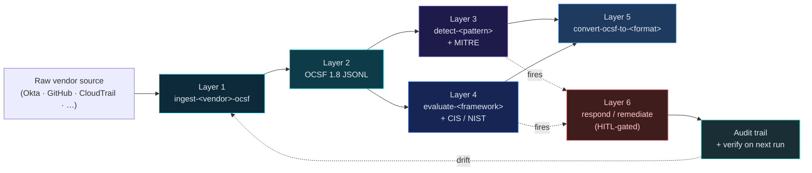

# Architecture

Five layers, one wire format, no shared library, agent-composable.

## The five layers

```mermaid
flowchart TB
    subgraph S["Sources (read-only)"]
        direction LR
        S1["AWS<br/>CloudTrail · VPC Flow · GuardDuty<br/>Config · EKS · IAM Analyzer · …"]
        S2["GCP<br/>Cloud Audit · VPC Flow<br/>SCC · GKE · …"]
        S3["Azure<br/>Activity Log · NSG Flow<br/>Defender · AKS · …"]
        S4["K8s audit<br/>kube-apiserver"]
        S5["Identity<br/>Okta · Entra · Workspace"]
        S6["SaaS<br/>GitHub · Slack · Workday<br/>Salesforce · SAP · M365"]
        S7["AI infra<br/>MCP proxy · model serving<br/>vector DB · inference logs"]
    end

    subgraph L1["LAYER 1 — Ingestion (one skill per source format)"]
        direction LR
        I1["ingest-cloudtrail-ocsf"]
        I2["ingest-vpc-flow-logs-ocsf"]
        I3["ingest-vpc-flow-logs-gcp-ocsf"]
        I4["ingest-nsg-flow-logs-azure-ocsf"]
        I5["ingest-guardduty-ocsf"]
        I6["ingest-security-hub-ocsf"]
        I7["ingest-gcp-scc-ocsf"]
        I8["ingest-azure-defender-for-cloud-ocsf"]
        I9["ingest-gcp-audit-ocsf"]
        I10["ingest-azure-activity-ocsf"]
        I11["ingest-k8s-audit-ocsf"]
        I12["ingest-mcp-proxy-ocsf"]
        I13["… one per source"]
    end

    OCSF["LAYER 2 — Normalised wire format<br/><b>OCSF 1.8 JSONL</b><br/>API Activity 6003 · Application Activity 6002<br/>Network Activity 4001 · HTTP Activity 4002<br/>Authentication 3002 · Account Change 3001<br/>Inventory Info 5001"]

    subgraph L3["LAYER 3 — Detection (OCSF → OCSF Detection Finding 2004)"]
        direction LR
        D1["detect-mcp-tool-drift<br/>T1195.001"]
        D2["detect-privilege-escalation-k8s<br/>T1552.007 · T1611 · T1098 · T1550.001"]
        D3["detect-credential-stuffing-okta<br/>T1110.003 (roadmap)"]
        D4["detect-lateral-movement<br/>T1021 · T1078.004"]
        D5["… one per attack pattern"]
    end

    subgraph L4["LAYER 4 — Evaluation (OCSF → OCSF Compliance Finding 2003)"]
        direction LR
        E1["evaluate-cis-aws-foundations-ocsf<br/>(roadmap)"]
        E2["evaluate-nist-csf-ocsf<br/>(roadmap)"]
        E3["evaluate-mitre-attack-coverage<br/>(roadmap)"]
        E4["evaluate-cis-k8s-ocsf<br/>(roadmap)"]
    end

    subgraph L5["LAYER 5 — View / convert (cross-vendor, built once)"]
        direction LR
        V1["convert-ocsf-to-sarif<br/>→ GitHub code scanning"]
        V2["convert-ocsf-to-mermaid-attack-flow<br/>→ PR comments"]
        V3["convert-ocsf-to-graph-overlay<br/>→ discover-environment graph"]
        V4["convert-ocsf-to-clickhouse<br/>→ analytics + dashboards"]
    end

    REM["LAYER 6 — Remediation (HITL-gated, audited)<br/>iam-departures-remediation<br/>… (other response skills, roadmap)"]

    S1 --> I1
    S1 --> I2
    S2 --> I3
    S3 --> I4
    S1 --> I5
    S1 --> I6
    S2 --> I7
    S3 --> I8
    S2 --> I9
    S3 --> I10
    S4 --> I11
    S7 --> I12

    I1 --> OCSF
    I2 --> OCSF
    I3 --> OCSF
    I4 --> OCSF
    I5 --> OCSF
    I6 --> OCSF
    I7 --> OCSF
    I8 --> OCSF
    I9 --> OCSF
    I10 --> OCSF
    I11 --> OCSF
    I12 --> OCSF
    I13 --> OCSF

    OCSF --> D1
    OCSF --> D2
    OCSF --> D3
    OCSF --> D4
    OCSF --> D5

    OCSF --> E1
    OCSF --> E2
    OCSF --> E3
    OCSF --> E4

    D1 --> V1
    D1 --> V2
    D2 --> V1
    D2 --> V2
    D2 --> V3
    E1 --> V1
    E2 --> V1
    E3 --> V2

    D2 -. fires .-> REM
    E1 -. fires .-> REM

    style S fill:#0b1120,stroke:#475569,color:#cbd5e1
    style L1 fill:#0c2a3a,stroke:#22d3ee,color:#e2e8f0
    style L3 fill:#1e1b4b,stroke:#a78bfa,color:#e2e8f0
    style L4 fill:#172554,stroke:#3b82f6,color:#e2e8f0
    style L5 fill:#1e3a5f,stroke:#60a5fa,color:#e2e8f0
    style OCSF fill:#0e3b48,stroke:#22d3ee,color:#e2e8f0
    style REM fill:#3f1d1d,stroke:#f87171,color:#fecaca
```



## Why layered

| Layer | Single responsibility | Why this is its own layer |
|---|---|---|
| **L1 — Ingestion** | Raw log → OCSF | One skill per source format. Bug in one parser doesn't break the others. Each skill needs only the IAM for *its* source. New source = new skill, zero touch to existing. |
| **L2 — Wire format** | OCSF 1.8 JSONL on stdin/stdout | The only contract every other layer agrees on. Pinned in [`OCSF_CONTRACT.md`](skills/detection-engineering/OCSF_CONTRACT.md). Drift from this is caught by deep-equality tests against frozen golden fixtures. |
| **L3 — Detection** | OCSF events → OCSF Detection Finding (2004) + MITRE | Stateless rules over normalised events. New attack pattern = new detect skill. Detection logic is decoupled from ingestion: a single `detect-credential-access` rule can run over CloudTrail OCSF, GCP audit OCSF, Azure activity OCSF — same code, three sources. |
| **L4 — Evaluation** | OCSF events → OCSF Compliance Finding (2003) + framework mapping | CIS / NIST / MITRE / SOC 2 controls re-implemented over OCSF, not over raw cloud SDKs. One ingestion fan-out, many evaluators. |
| **L5 — View / convert** | OCSF Finding → human / SIEM / graph format | Cross-vendor, built once. Every later vendor story uses the same convert skills. SARIF for GitHub Security tab, Mermaid for PR comments, ClickHouse for dashboards, graph overlay for `discover-environment`. |
| **L6 — Remediation** | Finding → action (HITL-gated, audited) | Listens to L3/L4 findings, requires explicit human-approved trigger, dual-writes audit. The only layer that touches write APIs. |

## How the layers compose

Skills are **standalone Python bundles** (per the Anthropic skills spec — no shared library, no cross-skill imports). They compose via stdin/stdout pipes like Unix tools:

```bash
# Example: K8s priv-esc detection from raw audit log to GitHub Security tab
python skills/ingestion/ingest-k8s-audit-ocsf/src/ingest.py audit.log \
  | python skills/detection/detect-privilege-escalation-k8s/src/detect.py \
  | python skills/view/convert-ocsf-to-sarif/src/convert.py \
  > findings.sarif

# Example: cross-cloud credential access (one detector, three sources)
cat cloudtrail.json | python skills/ingestion/ingest-cloudtrail-ocsf/src/ingest.py >> all-events.ocsf.jsonl
cat gcp-audit.json | python skills/ingestion/ingest-gcp-audit-ocsf/src/ingest.py >> all-events.ocsf.jsonl
cat azure.json    | python skills/ingestion/ingest-azure-activity-ocsf/src/ingest.py >> all-events.ocsf.jsonl
cat all-events.ocsf.jsonl | python skills/detection/detect-credential-access/src/detect.py > findings.ocsf.jsonl
```

Or, when an agent (Claude Code, Cursor, Codex, Cortex, Windsurf) loads several skills at once, the agent reads each `SKILL.md`, picks the right one for the user's intent, and pipes the output of one into the next as a tool composition step. The OCSF contract is what makes this safe — the agent doesn't need to know the internals of any skill, only that ingest skills emit OCSF and detect skills consume it.

## Vendor-story flow (closed loop per vendor)

A "vendor story" is one complete vertical slice through all six layers for one source vendor. Shipping a vendor story is the unit of value: a customer who has Okta gets a usable detection pipeline the day Okta lands.



## Where things sit today

After the current PRs land:

| Layer | Shipped | Roadmap |
|---|---|---|
| L1 Ingestion | `cloudtrail`, `gcp-audit`, `azure-activity`, `k8s-audit`, `mcp-proxy` (5) | `vpc-flow-logs`, `guardduty`, `aws-config`, `security-hub`, `eks-audit`, `okta-system-log`, `github-audit`, `entra-audit`, `workspace-admin`, `slack-audit`, `workday-audit`, `salesforce-event-mon`, `sap-audit-log`, … |
| L2 Wire format | OCSF 1.8 contract pinned in `OCSF_CONTRACT.md` | OCSF 1.9 migration when stable |
| L3 Detection | `detect-mcp-tool-drift`, `detect-privilege-escalation-k8s`, `detect-sensitive-secret-read-k8s`, `detect-lateral-movement` (4) | `detect-credential-stuffing-okta`, `detect-mfa-fatigue`, `detect-impossible-travel`, `detect-mcp-prompt-injection`, … |
| L4 Evaluation | (legacy `cspm-aws/gcp/azure-cis-benchmark` + `k8s-security-benchmark` + `container-security` — these will migrate to OCSF-based equivalents over time) | `evaluate-cis-aws-foundations-ocsf`, `evaluate-nist-csf-ocsf`, `evaluate-mitre-attack-coverage` |
| L5 View / convert | (none yet) | `convert-ocsf-to-sarif`, `convert-ocsf-to-mermaid-attack-flow`, `convert-ocsf-to-graph-overlay`, `convert-ocsf-to-clickhouse` |
| L6 Remediation | `iam-departures-remediation` (1) | More response automations as detection patterns mature |

Existing AI-infra skills (`model-serving-security`, `gpu-cluster-security`) and discovery (`discover-environment`) sit alongside as posture/topology tools that will eventually migrate to L4 evaluators consuming the L1 ingestion stream.

## Where the code lives today vs the layered model

The layered reshape has landed for the canonical skill paths. Current skill homes are:

```
skills/
├── ingestion/      ← L1
├── detection/      ← L3
├── evaluation/     ← L4
├── view/           ← L6
└── remediation/    ← L5
```

Legacy roots `skills/detection-engineering/`, `skills/compliance-cis-mitre/`, and
`skills/ai-infra-security/` remain temporarily as redirect / shared-resource
folders so external links do not break in one jump.
