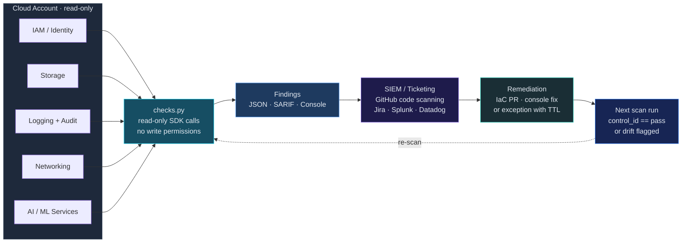
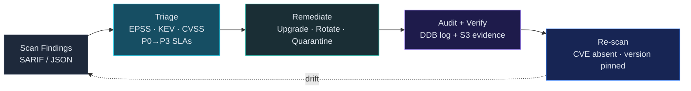
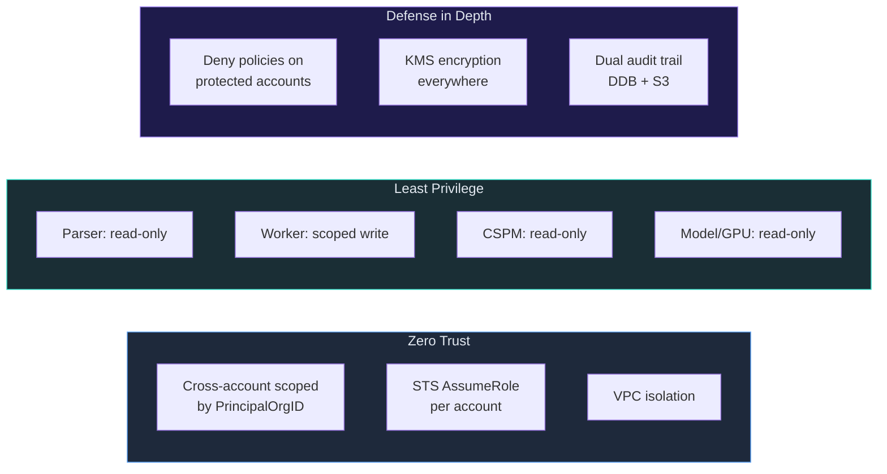

# cloud-security

[](https://github.com/msaad00/cloud-security/actions/workflows/ci.yml)
[](LICENSE)
[](https://www.python.org/downloads/)
[](https://github.com/msaad00/agent-bom)

Production-grade cloud and AI-infra security — organised into four functional categories, compliance-mapped to MITRE ATT&CK, NIST CSF, CIS, ISO 27001, and SOC 2. Every workflow is a closed loop: **detect → act → audit → re-verify**.

Each skill is a standalone Python script with its own checks, tests, examples, and `SKILL.md` definition following [Anthropic's skill spec](https://platform.claude.com/docs/en/build-with-claude/skills-guide). Skills can be used directly from the CLI, integrated into CI/CD pipelines, or referenced by AI agents that read `SKILL.md` files (Claude Desktop, Cortex Code, Cursor, Codex, Windsurf, etc.).

## Skills taxonomy

```
skills/
├── compliance-cis-mitre/          "Is this config/posture aligned with a published benchmark?"
├── remediation/                   "Something is wrong — fix it, gated and audited"
├── detection-engineering/         "What does an attack look like on this surface?"
└── ai-infra-security/             "AI-native surfaces: models, agents, GPU, topology"
```

See [`skills/README.md`](skills/README.md) for the full category index. The categories are functional, not organisational — a single incident (e.g. a leaked MCP credential) may touch a detection rule, a remediation pipeline, *and* a CIS control. Category = *what kind of work does this skill do*, not *which cloud*.

### compliance-cis-mitre/

| Skill | Scope | Checks | Description |
|-------|-------|--------|-------------|
| [cspm-aws-cis-benchmark](skills/compliance-cis-mitre/cspm-aws-cis-benchmark/) | AWS | 18 | CIS AWS Foundations v3.0 — IAM, Storage, Logging, Networking |
| [cspm-gcp-cis-benchmark](skills/compliance-cis-mitre/cspm-gcp-cis-benchmark/) | GCP | 7 | CIS GCP Foundations v3.0 — IAM, Cloud Storage, Networking |
| [cspm-azure-cis-benchmark](skills/compliance-cis-mitre/cspm-azure-cis-benchmark/) | Azure | 6 | CIS Azure Foundations v2.1 — Storage, Networking |
| [k8s-security-benchmark](skills/compliance-cis-mitre/k8s-security-benchmark/) | K8s | 10 | CIS Kubernetes — Pod security, RBAC, network policy |
| [container-security](skills/compliance-cis-mitre/container-security/) | Any | 8 | CIS Docker — Dockerfile best practices + runtime isolation |

### remediation/

| Skill | Scope | Description |
|-------|-------|-------------|
| [iam-departures-remediation](skills/remediation/iam-departures-remediation/) | Multi-cloud | Event-driven IAM cleanup for departed employees (HITL grace period, deny list, DLQ + SNS alerts) |
| [vuln-remediation-pipeline](skills/remediation/vuln-remediation-pipeline/) | AWS | Auto-remediate supply-chain vulns with EPSS/KEV triage (protected-package gate, idempotency) |

### detection-engineering/ 🆕

A new category for detection rules, threat hunts, and runtime monitors specific to AI infrastructure — MCP servers, agent topologies, model endpoints, vector stores, prompt caches. See [`skills/detection-engineering/README.md`](skills/detection-engineering/README.md) for the category contract and the seed roadmap.

| Skill | Surface | Description |
|-------|---------|-------------|
| [mcp-tool-drift-detection](skills/detection-engineering/mcp-tool-drift-detection/) | MCP proxy logs | Detects when a tool's `name`, `description`, `inputSchema`, or `annotations` change between calls in the same session — the MCP tool-poisoning TTP |

### ai-infra-security/

| Skill | Scope | Checks | Description |
|-------|-------|--------|-------------|
| [model-serving-security](skills/ai-infra-security/model-serving-security/) | Any | 16 | Model endpoint auth, rate limiting, egress, safety layers |
| [gpu-cluster-security](skills/ai-infra-security/gpu-cluster-security/) | Any | 13 | GPU runtime isolation, driver CVEs, InfiniBand, tenant isolation |
| [discover-environment](skills/ai-infra-security/discover-environment/) | Multi-cloud | — | Map cloud resources to a security graph with MITRE ATT&CK/ATLAS overlays |

## Architecture — IAM Departures Remediation

Six numbered stations across two deployment domains, one forward path, one dashed drift loop. Every destructive step happens inside the VPC-isolated Step Function; the reconciler stays stateless outside it.

<p align="center">
  
</p>

**What's intentionally not shown** (to keep the diagram legible):
- **Failure path** — Lambda async failures → SQS DLQ (`iam-departures-dlq`); Step Function `FAILED`/`TIMED_OUT`/`ABORTED` → EventBridge → SNS (`iam-departures-alerts`). See [`SKILL.md`](skills/remediation/iam-departures-remediation/SKILL.md).
- **DLQ replay** — stuck executions re-drive through the same EventBridge rule. The pipeline is idempotent.
- **Extensibility** — new consumers (SIEM forwarder, Slack, secondary region) are additional EventBridge targets. No reconciler or Lambda changes.

## Architecture — CSPM CIS Benchmarks

Closed loop: scan → finding → ticket/PR → fix → re-scan verifies the same control_id is now `pass`. Findings keep their `control_id` so the verification run can prove the gap closed.



## Architecture — Vulnerability Remediation Pipeline

Closed loop: scan → triage → patch → audit → re-scan verifies the CVE is no longer present *and* the package version matches the expected fix version.



## Security Model



## Compliance Framework Mapping

| Framework | Controls | Skills |
|-----------|----------|--------|
| **CIS AWS Foundations v3.0** | 18 controls | cspm-aws |
| **CIS GCP Foundations v3.0** | 7 controls (subset) | cspm-gcp |
| **CIS Azure Foundations v2.1** | 6 controls (subset) | cspm-azure |
| **MITRE ATT&CK** | T1078, T1098, T1087, T1195, T1530, T1599 | iam-departures, vuln-remediation |
| **NIST CSF 2.0** | PR.AC, PR.DS, DE.CM, DE.AE, RS.MI, ID.RA | All skills |
| **CIS Controls v8** | 5.3, 6.1, 6.2, 6.5, 7.1–7.4, 13.1, 16.1 | iam-departures, vuln-remediation |
| **SOC 2 TSC** | CC6.1–CC6.3, CC7.1 | iam-departures, vuln-remediation |
| **ISO 27001:2022** | A.5.15–A.8.24 | cspm-aws, cspm-gcp, cspm-azure |
| **PCI DSS 4.0** | 2.2, 7.1, 8.3, 10.1 | cspm skills |
| **OWASP LLM Top 10** | LLM-05, LLM-07, LLM-08 | vuln-remediation |
| **OWASP MCP Top 10** | MCP-04 | vuln-remediation |

> CIS GCP and CIS Azure currently automate a curated subset of high-impact controls. The full benchmark coverage is tracked in each skill's `SKILL.md`. PRs that add controls are welcome — keep one check per function and one finding row per control.

## CI/CD Pipeline

| CI Job | What |
|--------|------|
| Lint | ruff check + format |
| Tests | pytest per skill |
| CloudFormation | `cfn-lint` validation on all `infra/*.yaml` |
| Terraform | `terraform validate` on `infra/terraform/` |
| Security | `bandit` + hardcoded-secret grep on `skills/*/src/` |
| **agent-bom** | `code` (AI components) · `skills scan` (skill audit) · `fs` (packages + CVEs) · **`iac` (CloudFormation + Terraform)** with SARIF upload to the GitHub Security tab |

The "Scanned by agent-bom" badge above is backed by that last row — every push to `main` runs all four agent-bom scans against the repo, and the IaC findings land in GitHub code scanning.

## Quick Start

```bash
git clone https://github.com/msaad00/cloud-security.git
cd cloud-security

# compliance-cis-mitre — CSPM CIS benchmarks (read-only)
pip install boto3 google-cloud-resource-manager azure-identity
python skills/compliance-cis-mitre/cspm-aws-cis-benchmark/src/checks.py   --region us-east-1
python skills/compliance-cis-mitre/cspm-gcp-cis-benchmark/src/checks.py   --project my-project
python skills/compliance-cis-mitre/cspm-azure-cis-benchmark/src/checks.py --subscription <sub-id>

# remediation — dry-run mode (no mutations)
python skills/remediation/iam-departures-remediation/src/lambda_parser/handler.py --dry-run examples/manifest.json
python skills/remediation/vuln-remediation-pipeline/src/lambda_triage/handler.py < scan-findings.sarif

# detection-engineering — MCP tool drift detection on proxy logs
python skills/detection-engineering/mcp-tool-drift-detection/src/detect.py mcp-proxy.jsonl

# Run all real-skill tests
pip install pytest boto3 moto
pytest skills/compliance-cis-mitre/cspm-aws-cis-benchmark/tests/     -v -o "testpaths=tests"
pytest skills/compliance-cis-mitre/cspm-gcp-cis-benchmark/tests/     -v -o "testpaths=tests"
pytest skills/compliance-cis-mitre/cspm-azure-cis-benchmark/tests/   -v -o "testpaths=tests"
pytest skills/remediation/iam-departures-remediation/tests/          -v -o "testpaths=tests"
pytest skills/remediation/vuln-remediation-pipeline/tests/           -v -o "testpaths=tests"
pytest skills/detection-engineering/mcp-tool-drift-detection/tests/  -v -o "testpaths=tests"
```

## Contributing

See [CONTRIBUTING.md](CONTRIBUTING.md).

## Security

See [SECURITY.md](SECURITY.md).

## License

[Apache 2.0](LICENSE)
