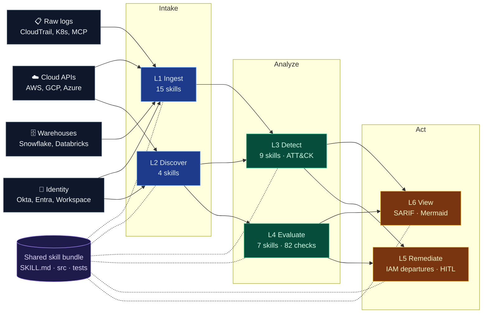
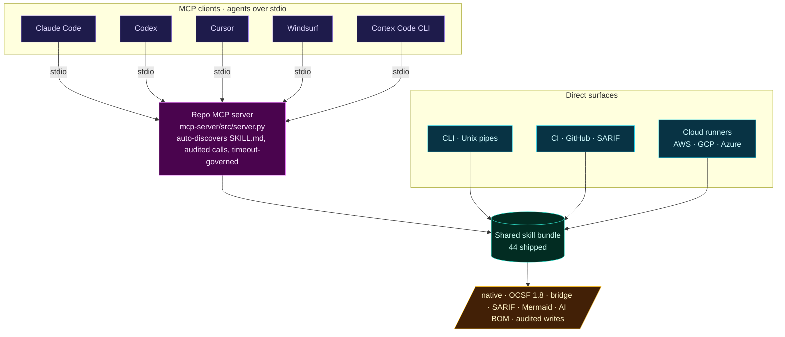

<p align="center">
  <a href="https://github.com/msaad00/cloud-ai-security-skills/actions/workflows/ci.yml?query=branch%3Amain"></a>
  <a href="CHANGELOG.md"></a>
  <a href="LICENSE"></a>
  <a href="https://www.python.org/downloads/"></a>
  <a href="https://schema.ocsf.io/1.8.0"></a>
  <a href="https://attack.mitre.org/"></a>
  <a href="docs/FRAMEWORK_MAPPINGS.md"></a>
  <a href="docs/COVERAGE_MODEL.md"></a>
  <a href="https://github.com/msaad00/agent-bom"></a>
</p>

---

## What this repo gives you

**45 shipped skill bundles** that turn raw cloud, identity, Kubernetes, and MCP signals into stable, standards-aligned findings — plus one guarded write path for offboarding. Each skill is a self-contained `SKILL.md + src/ + tests/` bundle that runs unchanged from the CLI, CI, MCP, or a persistent cloud runner.

| Layer | Count | Purpose | Output |
|---|---:|---|---|
| **Ingest** | 15 | normalize raw source → event stream | native JSONL **or** OCSF 1.8 |
| **Discover** | 4 | inventory, graph, AI BOM, evidence | native / bridge JSON |
| **Detect** | 10 | deterministic rules with MITRE ATT&CK | OCSF Detection Finding 2004 |
| **Evaluate** | 7 | 82 posture and benchmark checks | compliance result |
| **Remediate** | 1 | IAM departures (HITL + dual audit) | audited action trail |
| **View** | 2 | findings → review formats | SARIF · Mermaid |
| **Output** | 3 | append-only sinks (S3, Snowflake, ClickHouse) | persisted JSONL |
| **Sources** | 3 | warehouse query adapters (S3 Select, Snowflake, Databricks) | JSONL pass-through |

**Total: 45 shipped skills.**

### Why different layers use different formats

OCSF 1.8 is the **SIEM interop wire format** — valuable exactly where events flow to a downstream analyzer. It is not the universal internal format, and this repo is honest about where it fits:

| Layer | Default emit | Rationale |
|---|---|---|
| **Ingest** | OCSF 1.8 (native opt-in) | Raw vendor → OCSF is what OCSF was built for. SIEMs consume it natively |
| **Detect** | OCSF 1.8 Detection Finding 2004 (native opt-in) | Findings flow to SIEM / SOAR / ticketing — OCSF spares every downstream system from writing a custom parser |
| **Evaluate / CSPM** | native today, OCSF Compliance Finding 2003 planned opt-in (#29) | Ops dashboards prefer native; SIEM pipelines opt into OCSF |
| **Discover** | native / CycloneDX ML-BOM / bridge | Inventory graphs and AI BOM aren't events. OCSF Inventory Info 5001 is too thin to be worth forcing |
| **Remediate** | native | Remediation is a state change with an operator-owned audit trail, not a finding |
| **View** | OCSF **input**, SARIF / Mermaid out | The whole point is rendering OCSF for humans |
| **Output (sinks)** | pass-through | Sinks write whatever the producer emitted |

Full discussion: [docs/ARCHITECTURE.md §3 Layer model + §6 Wire contract](docs/ARCHITECTURE.md). The pinned OCSF contract for ingest + detect lives in [skills/detection-engineering/OCSF_CONTRACT.md](skills/detection-engineering/OCSF_CONTRACT.md).

## Architecture

External signals enter through two intake layers, pass through two analyze layers, and exit through two act layers. The same skill bundle contract sits underneath every layer.



Full contract: [docs/ARCHITECTURE.md](docs/ARCHITECTURE.md)

## Agent and runtime integrations

MCP clients go through the repo MCP server; CLI, CI, and cloud runners invoke the skill bundle directly. All four surfaces share the same implementation.



- **MCP** · [.mcp.json](.mcp.json) · [mcp-server/README.md](mcp-server/README.md) · [docs/MCP_AUDIT_CONTRACT.md](docs/MCP_AUDIT_CONTRACT.md)
- **CLI / pipes** · stdin/stdout bundles compose into one-liners
- **CI** · GitHub Actions publishes SARIF to the Security tab
- **Runners** · reference runners under [runners/](runners/) for S3/SQS, GCS/PubSub, Blob/EventGrid

## Start here

Pick the row that matches the job.

| You have… | Start with | Typical output |
|---|---|---|
| a raw log file or stream | [`ingest-*`](skills/ingestion/) → [`detect-*`](skills/detection/) | OCSF Detection Finding |
| live cloud API access | [`discover-*`](skills/discovery/) or [`evaluation/*`](skills/evaluation/) | graph / benchmark JSON |
| logs already in your lake (CloudTrail in S3, Okta in Snowflake, Databricks tables) | [`source-*`](skills/ingestion/) → `detect-*` → [`sink-*`](skills/remediation/) | customer-owned persistence |
| an AI estate to inventory | [`discover-ai-bom`](skills/discovery/discover-ai-bom/) | CycloneDX-aligned AI BOM |
| audit evidence to produce | [`discover-control-evidence`](skills/discovery/discover-control-evidence/) | PCI / SOC 2 evidence JSON |
| OCSF findings to publish | [`view/*`](skills/view/) | SARIF · Mermaid |
| a departing employee to offboard | [`iam-departures-aws`](skills/remediation/iam-departures-aws/) | dry-run plan or audited action |

Full crosswalk: [docs/USE_CASES.md](docs/USE_CASES.md)

## Common shipped flows

Three lanes. Same skill bundle contract in every lane — input, output, and control boundary are what change.

```
① Raw log detection
   raw payload ─▶ ingest-* ─▶ detect-* ─▶ view/*
                                        └─▶ SARIF · Mermaid attack flow

② Detection on data already in your lake
   CloudTrail in S3 ─┐
   Okta in Snowflake ─┼─▶ source-* ─▶ detect-* ─▶ sink-*
   Databricks tables ─┘                        └─▶ customer-owned persistence

③ Live posture and guarded action
   live cloud / SaaS ─▶ discover-* ─┐
                       evaluation-* ─┼─▶ remediation/* ─▶ HITL + dual audit
```

**Example — Kubernetes privilege escalation, end-to-end:**

```bash
python skills/ingestion/ingest-k8s-audit-ocsf/src/ingest.py \
  skills/detection-engineering/golden/k8s_audit_raw_sample.jsonl \
  | python skills/detection/detect-privilege-escalation-k8s/src/detect.py \
  | python skills/view/convert-ocsf-to-sarif/src/convert.py \
  > findings.sarif
```

**Same flow from an MCP agent:**

```text
tools/call name="ingest-k8s-audit-ocsf" args={"args":["skills/detection-engineering/golden/k8s_audit_raw_sample.jsonl"]}
tools/call name="detect-privilege-escalation-k8s" args={"input":"<stdout>"}
tools/call name="convert-ocsf-to-sarif"          args={"input":"<stdout>"}
```

<details>
<summary><b>What you get back</b></summary>

Raw audit line (abbreviated):
```json
{"kind":"Event","stage":"ResponseComplete","verb":"list","auditID":"k1-list-secrets","user":{"username":"system:serviceaccount:default:builder"}}
```

OCSF event (abbreviated):
```json
{"class_uid":6003,"class_name":"API Activity","metadata":{"uid":"k1-list-secrets"},"api":{"operation":"list"},"resources":[{"type":"secrets","namespace":"default"}]}
```

OCSF Detection Finding 2004 (abbreviated):
```json
{"class_uid":2004,"class_name":"Detection Finding","finding_info":{"title":"Service account enumerated and read a Kubernetes secret","attacks":[{"technique":{"uid":"T1552.007"}}]}}
```

Native wire format is the same content in a repo-owned envelope — see [docs/NATIVE_VS_OCSF.md](docs/NATIVE_VS_OCSF.md).

</details>

## Flagship · IAM departures remediation

The one shipped write path. Guarded, event-driven, dual-audited — and **one cloud per worker**, never cross-cloud.

![AWS-only IAM departures flow. Plan reads HR sources in Snowflake or Databricks, runs the reconciler, writes an S3 manifest of the actionable set. Orchestrate fires an EventBridge rule that starts a Step Function; the Step Function invokes a parser Lambda that re-checks manifest and IAM state, then a worker Lambda with a scoped principal that assumes a cross-account role inside the AWS Organization. Write deletes the AWS IAM user through the nine-step deletion order. Audit lands in DynamoDB plus KMS-encrypted S3, then ingest-back feeds drift checks into the next reconciler run. The footer makes clear that Azure and GCP use their own native orchestration stacks. No single worker ever crosses cloud boundaries.](docs/images/iam-departures-aws.svg)

- **scope first** — rehire and grace-window logic run in the reconciler before the manifest is written
- **separate principals** — EventBridge, Step Function, parser Lambda, worker Lambda each have their own execution role
- **one cloud per worker** — the AWS worker only touches AWS IAM via cross-account `AssumeRole` inside the Org. A single worker principal never spans cloud boundaries
- **dual audit** — DynamoDB + KMS-encrypted S3 for every write; ingest-back so the next run verifies closure

### Per-cloud service mapping

Only the AWS orchestration ships today (under [`infra/`](skills/remediation/iam-departures-aws/infra/)). For Azure and GCP, the **worker library code** lives in [`src/lambda_worker/clouds/`](skills/remediation/iam-departures-aws/src/lambda_worker/clouds/) (`azure_entra.py`, `gcp_iam.py`, `databricks_scim.py`, `snowflake_user.py`); the recommended native orchestration stack per cloud is documented below so operators pick equivalent primitives instead of forcing one stack across all clouds.

| Role | AWS · shipped | GCP · pattern | Azure · pattern |
|---|---|---|---|
| Event trigger | **EventBridge** rule (S3 `ObjectCreated`) | **Eventarc** trigger (GCS finalize) | **Event Grid** (Blob `Created`) |
| Orchestration | **Step Functions** (Map state, DLQ, retries) | **Cloud Workflows** (parallel, retries) | **Logic Apps** or **Durable Functions** |
| Worker compute | **Lambda** (parser + worker) | **Cloud Run Jobs** or **Cloud Functions** | **Azure Functions** or **Container Apps Jobs** |
| Object store for manifest + evidence | **S3** + **KMS** | **Cloud Storage** + **CMEK** | **Blob Storage** + **CMK** (Key Vault) |
| Key-value audit | **DynamoDB** (user, ts key) | **Firestore** / **Bigtable** | **Cosmos DB** / **Table Storage** |
| Identity target | **IAM** (cross-account, `aws:PrincipalOrgID`) | **Cloud IAM** (cross-project, Org policies) | **Entra ID** (tenant scope, Graph API) |
| DLQ / alerts | **SQS** + **SNS** | **Pub/Sub** + **Cloud Monitoring** | **Service Bus** + **Monitor Alerts** |

Details: [skills/remediation/iam-departures-aws/](skills/remediation/iam-departures-aws/) · [SKILL.md#cross-cloud-workflow-shape](skills/remediation/iam-departures-aws/SKILL.md)

## Native vs OCSF

| Mode | When | What it is |
|---|---|---|
| `ocsf` | default for ingest and detect streams | OCSF 1.8 JSONL pinned to [`OCSF_CONTRACT.md`](skills/detection-engineering/OCSF_CONTRACT.md) |
| `native` | when you want repo fidelity without an envelope | repo-owned external wire format with stable UIDs |
| `bridge` | when you need both | interoperable fields with native context preserved |
| `canonical` | internal only | the normalization model between ingest and detect |

The `-ocsf` suffix means OCSF is the default, not the only output. Reference: [docs/NATIVE_VS_OCSF.md](docs/NATIVE_VS_OCSF.md) · [docs/CANONICAL_SCHEMA.md](docs/CANONICAL_SCHEMA.md) · [docs/NORMALIZATION_EXAMPLES.md](docs/NORMALIZATION_EXAMPLES.md)

## Install and trust

This repo is not primarily distributed as a PyPI package. Operators clone a tagged release, verify the signed SBOM set, and install only the dependency groups they need from [`pyproject.toml`](pyproject.toml). `uv.lock` is the ceiling, real installs are narrower.

- [docs/SUPPLY_CHAIN.md](docs/SUPPLY_CHAIN.md) — SBOM, signing, provenance
- [docs/CREDENTIAL_PROVENANCE.md](docs/CREDENTIAL_PROVENANCE.md) — workload identity first
- [docs/RELEASE_CHECKLIST.md](docs/RELEASE_CHECKLIST.md) — release gates

## Security posture

- **Read-only by default.** Write paths are HITL, audited, and dry-run-first.
- **No hardcoded secrets.** Workload identity and short-lived credentials only.
- **Official SDKs first**, repo-owned code second, canonical OSS only when required.
- **CI gates** validate skill contracts, integrity, the safe-skill bar, coverage, mypy, and SBOM generation.
- **Runtime isolation.** Wrappers cannot fork the skill model; they add transport only.

[SECURITY.md](SECURITY.md) · [SECURITY_BAR.md](SECURITY_BAR.md) · [docs/THREAT_MODEL.md](docs/THREAT_MODEL.md) · [docs/RUNTIME_ISOLATION.md](docs/RUNTIME_ISOLATION.md)

## Compliance frameworks

CIS AWS / GCP / Azure Foundations · CIS Controls v8 · MITRE ATT&CK · NIST CSF 2.0 · SOC 2 TSC · ISO 27001:2022 · PCI DSS 4.0 · OWASP LLM Top 10 · OWASP MCP Top 10

Per-skill framework mapping: [docs/FRAMEWORK_MAPPINGS.md](docs/FRAMEWORK_MAPPINGS.md) · coverage report: [docs/FRAMEWORK_COVERAGE.md](docs/FRAMEWORK_COVERAGE.md)

## Where things stand

| Area | Shipped today | Planned |
|---|---|---|
| **Ingest** | 15 ingesters across AWS, GCP, Azure, K8s, Okta, Entra, Workspace, MCP | more identity and SaaS sources |
| **Discover** | 4 skills (AI BOM, cloud control evidence, control evidence, environment graph) | wider SaaS and infra evidence |
| **Detect** | 9 detectors tied to MITRE ATT&CK | credential stuffing, impossible travel, more MCP patterns |
| **Evaluate** | 7 benchmarks (82 checks) across CIS AWS/GCP/Azure, K8s, container, GPU, model serving | OCSF Compliance Finding class `2003` outputs |
| **Remediate** | IAM departures with HITL, dry-run, dual audit | broader remediation families as detection matures |
| **View** | SARIF, Mermaid attack flow | graph overlay, warehouse-ready converters |
| **Sinks** | Snowflake, ClickHouse, S3 | Security Lake, BigQuery |
| **Packs** | `lateral-movement`, `privilege-escalation-k8s` | broader warehouse dialect coverage |
| **Runners** | AWS S3/SQS, GCP GCS/PubSub, Azure Blob/EventGrid reference | more specialized runners on demand |

## Integration with agent-bom

This repo ships the security automations. [agent-bom](https://github.com/msaad00/agent-bom) provides continuous scanning and a unified graph. Use them together for detection + response.

## License

Apache 2.0. Security research is welcome — see [SECURITY.md](SECURITY.md) for coordinated disclosure.
