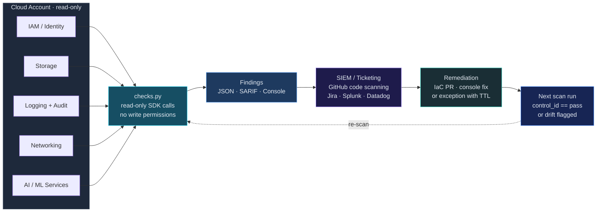
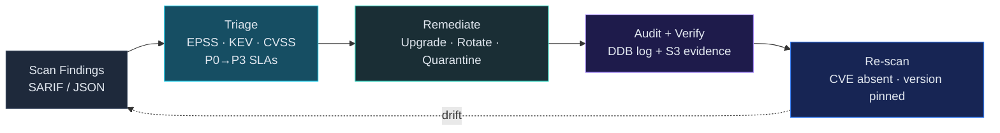
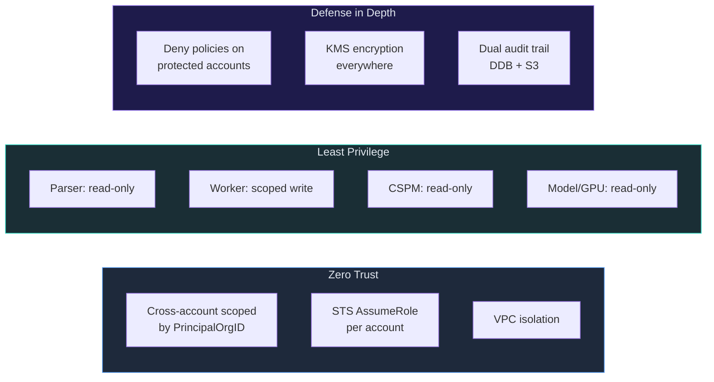

# cloud-security

[](https://github.com/msaad00/cloud-security/actions/workflows/ci.yml)
[](LICENSE)
[](https://www.python.org/downloads/)
[](https://github.com/msaad00/agent-bom)

Production-grade cloud security benchmarks and automation — 5 skills, compliance-mapped to MITRE ATT&CK, NIST CSF, CIS, ISO 27001, and SOC 2. Each workflow is a closed loop: detect → act → audit → re-verify.

Each skill is a standalone Python script with its own checks, tests, examples, and SKILL.md definition following [Anthropic's skill spec](https://docs.anthropic.com). Skills can be used directly from the CLI, integrated into CI/CD pipelines, or referenced by AI agents that read SKILL.md files (Claude Desktop, Cortex Code, etc.).

## Skills

| Skill | Scope | Checks | Description |
|-------|-------|--------|-------------|
| [cspm-aws-cis-benchmark](skills/cspm-aws-cis-benchmark/) | AWS | 18 | CIS AWS Foundations v3.0 — IAM, Storage, Logging, Networking |
| [cspm-gcp-cis-benchmark](skills/cspm-gcp-cis-benchmark/) | GCP | 7 | CIS GCP Foundations v3.0 — IAM, Cloud Storage, Networking |
| [cspm-azure-cis-benchmark](skills/cspm-azure-cis-benchmark/) | Azure | 6 | CIS Azure Foundations v2.1 — Storage, Networking |
| [iam-departures-remediation](skills/iam-departures-remediation/) | Multi-cloud | — | Auto-remediate IAM for departed employees across 5 clouds |
| [vuln-remediation-pipeline](skills/vuln-remediation-pipeline/) | AWS | — | Auto-remediate supply chain vulns with EPSS triage |

## Architecture — IAM Departures Remediation

Closed-loop, event-driven pipeline. HR change → S3 manifest → EventBridge → Step Function → cloud deactivation → dual-write audit → ingest back into the source warehouse so the next reconciler run *verifies* the previous run actually closed.

```mermaid
flowchart LR
    HR["HR Sources\nWorkday · Snowflake\nDatabricks · ClickHouse"]
    REC["Reconciler\nSHA-256 row diff\nchange detect\nKMS encrypted"]
    S3["S3 Manifest\nKMS · versioned\nEventBridge enabled"]
    EB["EventBridge Rule\nObject Created\nprefix: departures/\nsuffix: .json"]
    SFN["Step Function\nParser: validate · grace · rehire\nWorker: 13-step IAM cleanup\nMap concurrency 10"]
    TGT["5 Cloud Targets\nAWS IAM · Azure Entra\nGCP IAM · Snowflake · Databricks"]
    AUDIT["Audit Trail\nDynamoDB + S3\nKMS encrypted"]
    WH["Warehouse Ingest-Back\nremediation_log table\nSnowflake / Databricks"]
    VERIFY["Next Reconciler Run\nverify state == closed\nflag drift / partial cleanup"]
    DLQ["DLQ + SNS Alerts\nLambda async failures\nSFN ExecutionFailed\nEventBridge → on-call"]

    HR --> REC --> S3 --> EB --> SFN --> TGT --> AUDIT --> WH --> VERIFY
    VERIFY -. drift detected .-> REC
    SFN -. failure .-> DLQ
    DLQ -. replay .-> EB

    style HR fill:#1e293b,stroke:#475569,color:#e2e8f0
    style REC fill:#164e63,stroke:#22d3ee,color:#e2e8f0
    style S3 fill:#1e293b,stroke:#475569,color:#e2e8f0
    style EB fill:#172554,stroke:#3b82f6,color:#e2e8f0
    style SFN fill:#164e63,stroke:#22d3ee,color:#e2e8f0
    style TGT fill:#1e3a5f,stroke:#60a5fa,color:#e2e8f0
    style AUDIT fill:#1e1b4b,stroke:#a78bfa,color:#e2e8f0
    style WH fill:#1e1b4b,stroke:#a78bfa,color:#e2e8f0
    style VERIFY fill:#1a2e35,stroke:#2dd4bf,color:#e2e8f0
    style DLQ fill:#3f1d1d,stroke:#f87171,color:#fecaca
```



**Why event-driven and closed-loop, not fire-and-forget:**
- *Decoupling:* Reconciler is stateless — it only writes the manifest. Failed runs are replayed by re-emitting the S3 event, no HR re-pull needed.
- *Single trigger surface:* EventBridge is the only path to the Step Function. Manual replays, out-of-band uploads, and scheduled syncs all hit the same audit point.
- *Verification:* DynamoDB + S3 audit rows are ingested back into the source warehouse, so the next reconciler diff *cross-checks* the previous remediation actually landed. Drift becomes a finding, not a silent failure.
- *Failure path:* Lambda async failures land in an SQS DLQ. Step Function `ExecutionFailed` events page on-call via SNS. DLQ messages can be re-driven through EventBridge — the loop closes even on errors.
- *Extensible:* Adding a SIEM forwarder, Slack notifier, or secondary region is a new EventBridge target — no Lambda or reconciler change.

## Architecture — CSPM CIS Benchmarks

Closed loop: scan → finding → ticket/PR → fix → re-scan verifies the same control_id is now `pass`. Findings keep their `control_id` so the verification run can prove the gap closed.



## Architecture — Vulnerability Remediation Pipeline

Closed loop: scan → triage → patch → audit → re-scan verifies the CVE is no longer present *and* the package version matches the expected fix version.



## Security Model



## Compliance Framework Mapping

| Framework | Controls | Skills |
|-----------|----------|--------|
| **CIS AWS Foundations v3.0** | 18 controls | cspm-aws |
| **CIS GCP Foundations v3.0** | 7 controls (subset) | cspm-gcp |
| **CIS Azure Foundations v2.1** | 6 controls (subset) | cspm-azure |
| **MITRE ATT&CK** | T1078, T1098, T1087, T1195, T1530, T1599 | iam-departures, vuln-remediation |
| **NIST CSF 2.0** | PR.AC, PR.DS, DE.CM, DE.AE, RS.MI, ID.RA | All skills |
| **CIS Controls v8** | 5.3, 6.1, 6.2, 6.5, 7.1–7.4, 13.1, 16.1 | iam-departures, vuln-remediation |
| **SOC 2 TSC** | CC6.1–CC6.3, CC7.1 | iam-departures, vuln-remediation |
| **ISO 27001:2022** | A.5.15–A.8.24 | cspm-aws, cspm-gcp, cspm-azure |
| **PCI DSS 4.0** | 2.2, 7.1, 8.3, 10.1 | cspm skills |
| **OWASP LLM Top 10** | LLM-05, LLM-07, LLM-08 | vuln-remediation |
| **OWASP MCP Top 10** | MCP-04 | vuln-remediation |

> CIS GCP and CIS Azure currently automate a curated subset of high-impact controls. The full benchmark coverage is tracked in each skill's `SKILL.md`. PRs that add controls are welcome — keep one check per function and one finding row per control.

## CI/CD Pipeline

| CI Job | What |
|--------|------|
| Lint | ruff check + format |
| Tests | pytest per skill |
| CloudFormation | cfn-lint validation |
| Terraform | terraform validate |
| Security | bandit + hardcoded secret grep on `skills/*/src/` |

## Quick Start

```bash
git clone https://github.com/msaad00/cloud-security.git
cd cloud-security

# CSPM CIS benchmarks (read-only)
pip install boto3 google-cloud-resource-manager azure-identity
python skills/cspm-aws-cis-benchmark/src/checks.py   --region us-east-1
python skills/cspm-gcp-cis-benchmark/src/checks.py   --project my-project
python skills/cspm-azure-cis-benchmark/src/checks.py --subscription <sub-id>

# IAM departures remediation — dry-run mode (no IAM mutations)
python skills/iam-departures-remediation/src/lambda_parser/handler.py --dry-run examples/manifest.json

# Vulnerability remediation pipeline — local triage
python skills/vuln-remediation-pipeline/src/lambda_triage/handler.py < scan-findings.sarif

# Run tests
pip install pytest boto3 moto
pytest skills/cspm-aws-cis-benchmark/tests/      -v -o "testpaths=tests"
pytest skills/cspm-gcp-cis-benchmark/tests/      -v -o "testpaths=tests"
pytest skills/cspm-azure-cis-benchmark/tests/    -v -o "testpaths=tests"
pytest skills/iam-departures-remediation/tests/  -v -o "testpaths=tests"
pytest skills/vuln-remediation-pipeline/tests/   -v -o "testpaths=tests"
```

## Contributing

See [CONTRIBUTING.md](CONTRIBUTING.md).

## Security

See [SECURITY.md](SECURITY.md).

## License

[Apache 2.0](LICENSE)
