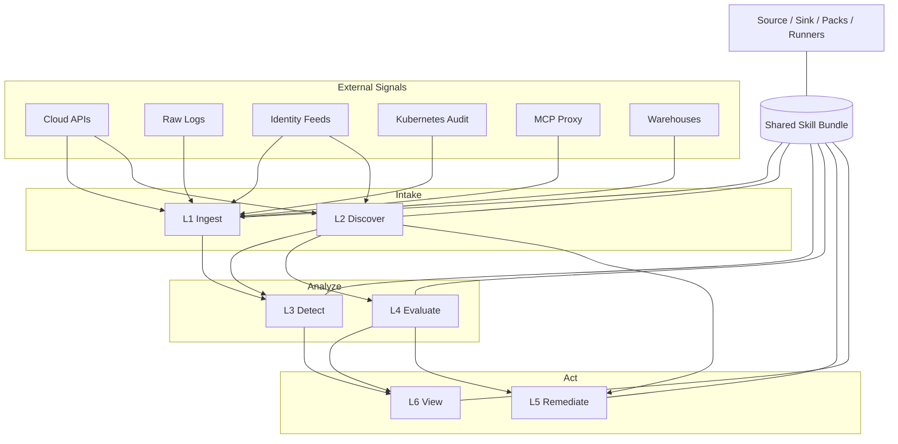
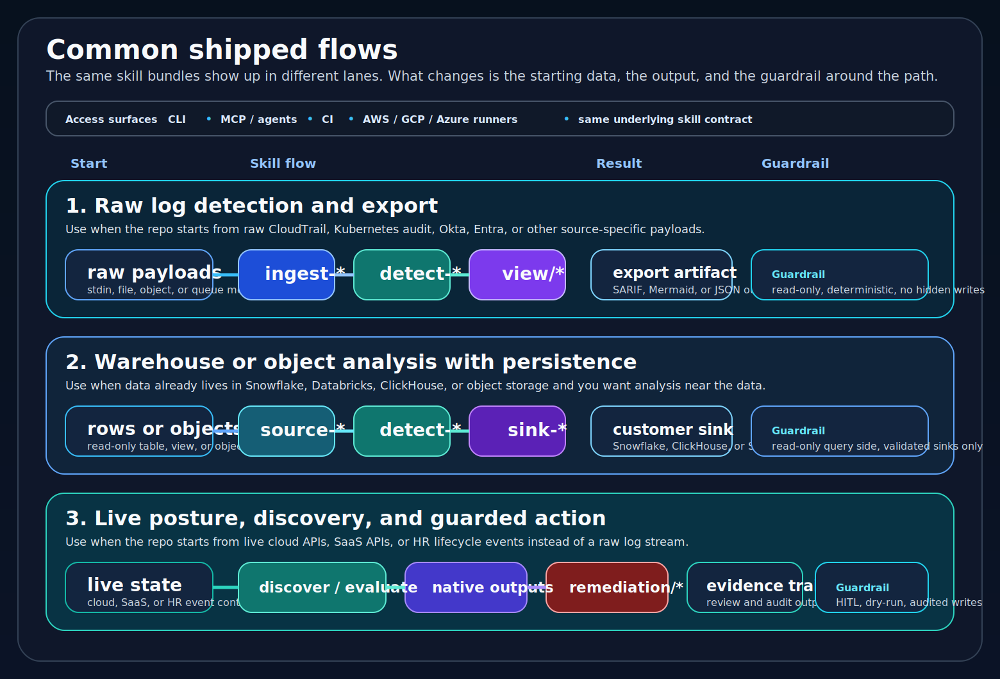
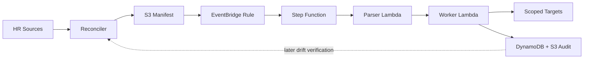

# cloud-ai-security-skills

[](https://github.com/msaad00/cloud-ai-security-skills/actions/workflows/ci.yml?query=branch%3Amain)
[](CHANGELOG.md)
[](LICENSE)
[](https://www.python.org/downloads/)
[](https://schema.ocsf.io/1.8.0)
[](docs/COVERAGE_MODEL.md)
[](https://github.com/msaad00/agent-bom)

Security skills for cloud and AI systems. Use source-specific ingest, discovery, detection, evaluation, view, and remediation skills from the CLI, CI, MCP, or persistent runners without changing the skill code.

- OCSF 1.8 is the default interoperable wire format for event and finding streams.
- Native is the repo-owned operational format for evaluation, discovery, sinks, remediation, and domains where OCSF would be lossy.
- Read-only by default; write paths stay HITL and audited.
- Trust, schema, and runtime behavior are documented and validated in CI.

## Repo Shape

Start here if you want the shortest true picture of the repo:




The mental model:

- core skill layers:
  - `ingest`, `discover`, `detect`, `evaluate`, `remediation`, `view`
- edge layers:
  - `source-*`, `sink-*`, `packs/*`
- runtime surfaces:
  - CLI, CI, MCP, and runners all call the same skill bundles

For the full contract, see [docs/ARCHITECTURE.md](docs/ARCHITECTURE.md). For the visual index, see [docs/DIAGRAMS.md](docs/DIAGRAMS.md).

## Start Here

| If you need to... | Start with... | Typical output |
|---|---|---|
| Normalize one raw source | `ingest-*` | repo-native JSONL or OCSF JSONL |
| Detect suspicious behavior | `ingest-*` + `detect-*` | repo-native finding JSON or OCSF Detection Finding |
| Benchmark posture | `evaluation/*` | benchmark or control results |
| Inventory cloud or AI assets | `discover-environment` or `discover-ai-bom` | graph JSON, AI BOM, OCSF bridge |
| Build evidence for audits | `discover-control-evidence` or `discover-cloud-control-evidence` | evidence JSON |
| Export findings | `view/*` | SARIF or Mermaid attack flow |
| Remediate offboarding safely | `iam-departures-remediation` | dry-run plan or audited action log |

For the full source, asset, framework, and runtime crosswalk, see [docs/USE_CASES.md](docs/USE_CASES.md).

## Common Shipped Flows

Use this as the quick mental model for how data moves through the repo:

```mermaid
flowchart TB
    subgraph Lane1[Raw Log Detection And Export]
        raw[Raw Payloads] --> ingest1[ingest-*]
        ingest1 --> detect1[detect-*]
        detect1 --> view1[view/*]
        view1 --> artifact[Export Artifact]
    end

    subgraph Lane2[Warehouse Or Object Analysis]
        rows[Rows Or Objects] --> source[source-*]
        source --> detect2[detect-*]
        detect2 --> sink[sink-*]
        sink --> persistence[Customer Sink]
    end

    subgraph Lane3[Live Posture And Guarded Action]
        live[Live State] --> discover_eval[discover-* / evaluation/*]
        discover_eval --> native[Native Outputs]
        native --> remediation[remediation/*]
        remediation --> audit[Evidence Trail]
    end
```





The visual is intentionally short. The exact examples live in markdown:

- raw logs:
  - `ingest-* -> detect-* -> view/*`
  - example: `ingest-cloudtrail-ocsf -> detect-lateral-movement -> convert-ocsf-to-sarif`
- warehouse or object rows:
  - `source-* -> detect-* -> sink-*`
  - example: `source-snowflake-query -> detect-lateral-movement -> sink-snowflake-jsonl`
- live cloud or SaaS state:
  - `discover-*` or `evaluation/*`, with optional guarded `remediation/*`
  - example: `discover-control-evidence`, `cspm-aws-cis-benchmark`, or `iam-departures-remediation`

For the longer runtime and data-path explanation, see [docs/DATA_HANDLING.md](docs/DATA_HANDLING.md) and [docs/DIAGRAMS.md](docs/DIAGRAMS.md).

## Install And Trust Model

This repo is not primarily distributed as a single PyPI-installed application.

The intended trust and execution model is:

- clone the repo at a tagged release
- verify the signed tag and release-attached signed SBOM set
- install only the dependency groups you actually need from `pyproject.toml`
- run the skill bundles directly, through MCP, in CI, or behind the shipped runners

In other words:

- `uv.lock` is the full dependency ceiling
- real operator installs are narrower and runtime-specific
- the trust boundary is the repo release itself, not an opaque package wrapper

See:

- [docs/SUPPLY_CHAIN.md](docs/SUPPLY_CHAIN.md)
- [docs/CREDENTIAL_PROVENANCE.md](docs/CREDENTIAL_PROVENANCE.md)
- [docs/RELEASE_CHECKLIST.md](docs/RELEASE_CHECKLIST.md)

## Quick Run

Each shipped skill is a bundle:

- `SKILL.md` for routing, guardrails, and approval model
- `REFERENCES.md` for the official source-of-truth docs
- `src/` for the executable implementation
- `tests/` for contract and regression coverage

The execution core is only one part. The operational contract is the whole
bundle.

### Use the skill name first

The normal integration path is the skill name through MCP or an agent client,
not a raw subprocess command.

For the Kubernetes example, the skill-level flow is:

```text
tools/call name="ingest-k8s-audit-ocsf"
arguments={
  "args":["skills/detection-engineering/golden/k8s_audit_raw_sample.jsonl"],
  "output_format":"ocsf"
}

tools/call name="detect-privilege-escalation-k8s"
arguments={
  "input":"<stdout from ingest-k8s-audit-ocsf>",
  "output_format":"ocsf"
}

tools/call name="convert-ocsf-to-sarif"
arguments={
  "input":"<stdout from detect-privilege-escalation-k8s>"
}
```

That is the contract the repo wants humans and agents to think in:

- skill name from `SKILL.md`
- `input`, `args`, and optional `output_format`
- routing, references, and guardrails from the skill bundle
- the same execution core underneath CLI, CI, MCP, and runners

The same path can be driven by:

- MCP / agents:
  - Claude, Codex, Cursor, Windsurf, Cortex Code CLI
- CI:
  - the same skill bundle called inside a pipeline job
- runners:
  - the same skill bundle called behind AWS, GCP, or Azure event wrappers

If you want to stand up the local MCP surface, use the project-scoped config in
[`.mcp.json`](.mcp.json) or the local wrapper instructions in
[mcp-server/README.md](mcp-server/README.md).

### What you should expect back

Most flows reduce to one of these outcomes:

- `ingest-* -> detect-* -> view/*`
  - start from raw payloads
  - end in SARIF, Mermaid, or review JSON
- `source-* -> detect-* -> sink-*`
  - start from a warehouse or object row set
  - end in customer-owned persistence
- `discover-*` or `evaluation/* -> remediation/*`
  - start from live state or HR events
  - end in evidence, audit records, or guarded writes

The low-level subprocess examples still exist for debugging and wrapper authors,
but they are intentionally kept out of the main entry path. See
[docs/DATA_HANDLING.md](docs/DATA_HANDLING.md) and the individual `SKILL.md`
files when you need wrapper-free execution details.

<details>
<summary><b>Low-level execution core examples</b></summary>

The same Kubernetes path can still be run directly when you are debugging a
wrapper or developing around the raw subprocess surface:

```bash
python skills/ingestion/ingest-k8s-audit-ocsf/src/ingest.py \
  skills/detection-engineering/golden/k8s_audit_raw_sample.jsonl \
  | python skills/detection/detect-privilege-escalation-k8s/src/detect.py \
  | python skills/view/convert-ocsf-to-sarif/src/convert.py \
  > findings.sarif
```

If you want to inspect each stage separately, write local scratch files in the
current directory:

```bash
python skills/ingestion/ingest-k8s-audit-ocsf/src/ingest.py \
  skills/detection-engineering/golden/k8s_audit_raw_sample.jsonl \
  > k8s-events.ocsf.jsonl

python skills/detection/detect-privilege-escalation-k8s/src/detect.py \
  k8s-events.ocsf.jsonl \
  > k8s-findings.ocsf.jsonl

python skills/view/convert-ocsf-to-sarif/src/convert.py \
  k8s-findings.ocsf.jsonl \
  > findings.sarif
```

Those intermediate files are only for debugging. The final output you usually
keep is `findings.sarif`.

If you want the repo-owned native wire format instead of OCSF:

```bash
python skills/ingestion/ingest-k8s-audit-ocsf/src/ingest.py \
  --output-format native \
  skills/detection-engineering/golden/k8s_audit_raw_sample.jsonl \
  | python skills/detection/detect-privilege-escalation-k8s/src/detect.py \
      --output-format native \
  > findings.native.jsonl
```

</details>

<details>
<summary><b>Real input and output</b></summary>

Input fixture line, abbreviated:

```json
{"kind":"Event","stage":"ResponseComplete","verb":"list","auditID":"k1-list-secrets","user":{"username":"system:serviceaccount:default:builder"}}
```

OCSF event output, abbreviated:

```json
{"class_uid":6003,"class_name":"API Activity","metadata":{"uid":"k1-list-secrets"},"api":{"operation":"list"},"resources":[{"type":"secrets","namespace":"default"}]}
```

Native event output, abbreviated:

```json
{"schema_mode":"native","record_type":"api_activity","event_uid":"k1-list-secrets","operation":"list","resources":[{"type":"secrets","namespace":"default"}]}
```

OCSF finding output, abbreviated:

```json
{"class_uid":2004,"class_name":"Detection Finding","finding_info":{"title":"Service account enumerated and read a Kubernetes secret"}}
```

Native finding output, abbreviated:

```json
{"schema_mode":"native","record_type":"detection_finding","title":"Service account enumerated and read a Kubernetes secret"}
```

</details>

### Same skill bundle, different access path

Agent clients do not require a second implementation. The same skill bundle is
what ships everywhere:

- MCP / agent:
  - skill name plus `input`, `args`, and optional `output_format`
- CI:
  - the same bundle called inside a job
- runner:
  - the same bundle called behind event-driven wrappers
- execution core:
  - the underlying subprocess entrypoint documented in the skill bundle and in
    [docs/DATA_HANDLING.md](docs/DATA_HANDLING.md)

## Native vs OCSF

| Mode | What it means | Use it when... |
|---|---|---|
| `native` | repo-owned external wire format in JSONL, with fields like `schema_mode`, `canonical_schema_version`, `record_type`, and stable UIDs | you want the repo's stable schema without an interoperability envelope |
| `ocsf` | OCSF JSONL pinned to the repo's OCSF contract | you want a standard external schema for SIEMs, exports, or downstream tooling |
| `canonical` | internal-only normalization model | you are reading the docs or implementation, not choosing a CLI output mode |
| `bridge` | interoperable output with native context preserved | you need both standard fields and repo context in one payload |

`native` is not raw vendor JSON and not an OCSF envelope with fields stripped out.
`native` = repo-owned external wire format. See [docs/NATIVE_VS_OCSF.md](docs/NATIVE_VS_OCSF.md), [docs/CANONICAL_SCHEMA.md](docs/CANONICAL_SCHEMA.md), [docs/NORMALIZATION_REFERENCE.md](docs/NORMALIZATION_REFERENCE.md), and [docs/NORMALIZATION_EXAMPLES.md](docs/NORMALIZATION_EXAMPLES.md).

## Flagship Example

The flagship example skill family is IAM departures remediation: a guarded, event-driven workflow with a dual audit trail and clear trust boundaries.




The diagram shows the flagship write path only: source events feed a guarded
planner/worker flow, the reconciler writes an S3 manifest, EventBridge starts
the Step Function, human approval gates the write edge, and the final action
trail lands in both operational storage and durable audit outputs.

The artwork is intentionally staged into:

- actionable selection
- guarded orchestration
- scoped writes
- dual audit and drift verification

The detailed examples, failure notes, and role tables stay in markdown so the
visual stays readable in GitHub preview.

Important accuracy notes:

- rehire and primary eligibility logic happen in the reconciler/export path before actionable entries are written to the S3 manifest
- the parser Lambda is a second safety gate that rechecks manifest validity, grace period, and current IAM state before the worker runs
- EventBridge, Step Function, parser Lambda, and worker Lambda each use separate execution roles
- the flagship orchestration is AWS-native on purpose; equivalent GCP and Azure workflows should keep the same control contract but use native event and orchestration services for those clouds

## Trust, Security, And Supply Chain

- Read-only by default; write paths require human approval and audit.
- No hardcoded secrets; prefer workload identity and short-lived credentials.
- Official vendor SDKs first, repo-owned code second, canonical OSS only when needed.
- CI validates skill contracts, integrity, safe-skill bar, coverage, type checking, and SBOM generation.

Read next:
- [SECURITY.md](SECURITY.md)
- [SECURITY_BAR.md](SECURITY_BAR.md)
- [docs/THREAT_MODEL.md](docs/THREAT_MODEL.md)
- [docs/CREDENTIAL_PROVENANCE.md](docs/CREDENTIAL_PROVENANCE.md)
- [docs/SUPPLY_CHAIN.md](docs/SUPPLY_CHAIN.md)
- [docs/RELEASE_CHECKLIST.md](docs/RELEASE_CHECKLIST.md)
- [docs/SCHEMA_VERSIONING.md](docs/SCHEMA_VERSIONING.md)
- [docs/RUNTIME_PROFILES.md](docs/RUNTIME_PROFILES.md)

## Core Surfaces

| Surface | Best fit |
|---|---|
| CLI / Unix pipes | local triage, fixture testing, repeatable one-shot pipelines |
| MCP | Claude, Codex, Cursor, Windsurf, Cortex Code CLI |
| CI | scheduled checks, PR gates, SARIF generation, benchmark snapshots |
| Persistent runner | event-driven or batch execution around the same stateless skills |
| SIEM / lakehouse | normalized findings, evidence, or customer-owned audit sinks |

## Shipped Vs Planned

| Topic | Shipped today | Planned / supported pattern |
|---|---|---|
| Runtime surfaces | CLI, CI, MCP, AWS/GCP/Azure reference runners, IAM departures workflow | more specialized runners and dialect-specific wrappers where demand justifies them |
| Persistence edges | `sink-snowflake-jsonl`, `sink-clickhouse-jsonl`, `sink-s3-jsonl`, plus IAM departures dual-write to DynamoDB + S3 | additional customer-controlled destinations like Security Lake and BigQuery |
| Query packs | `packs/lateral-movement/` and `packs/privilege-escalation-k8s/` | broader warehouse and dialect coverage |
| Schema modes | native, canonical, OCSF, and bridge are all shipped; ingest and detect are fully dual-mode, while discovery uses native/bridge and evaluation, sinks, and remediation stay native-first | extend OCSF or bridge only where it materially improves interoperability without losing operational clarity |
| Remediation | IAM departures with HITL and audit | broader remediation families |

<details>
<summary><b>Schema Modes</b></summary>

The repo contract supports `native`, `canonical`, `ocsf`, and `bridge`.

- `canonical`: internal repo-owned normalization layer
- `native`: repo-owned external wire format
- `ocsf`: interoperable external wire format
- `bridge`: native context preserved alongside interoperable fields

`-ocsf` in a skill name means OCSF is the default wire format, not necessarily the only supported output.

Read next:
- [docs/NATIVE_VS_OCSF.md](docs/NATIVE_VS_OCSF.md)
- [docs/CANONICAL_SCHEMA.md](docs/CANONICAL_SCHEMA.md)
- [docs/NORMALIZATION_REFERENCE.md](docs/NORMALIZATION_REFERENCE.md)
- [docs/NORMALIZATION_EXAMPLES.md](docs/NORMALIZATION_EXAMPLES.md)
- [docs/DATA_FLOW.md](docs/DATA_FLOW.md)
- [docs/DATA_HANDLING.md](docs/DATA_HANDLING.md)
- [docs/OCSF_CONTRACT.md](docs/OCSF_CONTRACT.md)

</details>

<details>
<summary><b>Layers And Runtime Model</b></summary>

| Layer | Use it for | Start with |
|---|---|---|
| Ingest | raw source to stable event stream | source-specific `ingest-*` |
| Discover | inventory, graph context, evidence | `discover-*` |
| Detect | deterministic attack-pattern findings | `detect-*` |
| Evaluate | benchmark and posture checks | `evaluation/*` |
| View | export into downstream formats | `view/*` |
| Remediate | guarded write path with HITL and audit | `iam-departures-remediation` |

The skill contract stays the same across runtime surfaces: `SKILL.md + src/ + tests/` is the product; CLI, CI, MCP, and runners are only access paths.

Read next:
- [docs/ARCHITECTURE.md](docs/ARCHITECTURE.md)
- [docs/DATA_HANDLING.md](docs/DATA_HANDLING.md)
- [docs/RUNTIME_ISOLATION.md](docs/RUNTIME_ISOLATION.md)
- [docs/DIAGRAMS.md](docs/DIAGRAMS.md)
- [docs/images/runtime-surfaces.svg](docs/images/runtime-surfaces.svg)

</details>

<details>
<summary><b>More Diagrams And Docs</b></summary>

Primary visuals:
- [Repository architecture](docs/images/repo-architecture.svg)
- [End-to-end skill flows](docs/images/end-to-end-skill-flows.svg)
- [IAM departures workflow](docs/images/iam-departures-architecture.svg)

Secondary visuals:
- [Data handling paths](docs/images/data-handling-paths.svg)
- [Start here guide](docs/images/start-here-guide.svg)
- [Runtime surfaces](docs/images/runtime-surfaces.svg)
- [Detection engineering pipeline](docs/images/detection-pipeline.svg)
- [IAM departures data flow](docs/images/iam-departures-data-flow.svg)

Operator and contributor docs:
- [AGENTS.md](AGENTS.md)
- [CLAUDE.md](CLAUDE.md)
- [docs/DESIGN_DECISIONS.md](docs/DESIGN_DECISIONS.md)
- [docs/SCHEMA_VERSIONING.md](docs/SCHEMA_VERSIONING.md)
- [docs/SCHEMA_COVERAGE.md](docs/SCHEMA_COVERAGE.md)
- [docs/NORMALIZATION_REFERENCE.md](docs/NORMALIZATION_REFERENCE.md)
- [docs/NORMALIZATION_EXAMPLES.md](docs/NORMALIZATION_EXAMPLES.md)
- [docs/THREAT_MODEL.md](docs/THREAT_MODEL.md)
- [docs/DATA_HANDLING.md](docs/DATA_HANDLING.md)
- [docs/ERROR_CODES.md](docs/ERROR_CODES.md)
- [docs/COMPLIANCE_MAPPINGS.md](docs/COMPLIANCE_MAPPINGS.md)
- [AGENTS.md](AGENTS.md)
- [skills/README.md](skills/README.md)
- [docs/TROUBLESHOOTING.md](docs/TROUBLESHOOTING.md)
- [docs/FRAMEWORK_COVERAGE.md](docs/FRAMEWORK_COVERAGE.md)
- [docs/FRAMEWORK_MAPPINGS.md](docs/FRAMEWORK_MAPPINGS.md)
- [docs/ROADMAP.md](docs/ROADMAP.md)
- [CONTRIBUTING.md](CONTRIBUTING.md)

</details>

## License

Apache 2.0. Security research is welcome; see [SECURITY.md](SECURITY.md) for coordinated disclosure.
