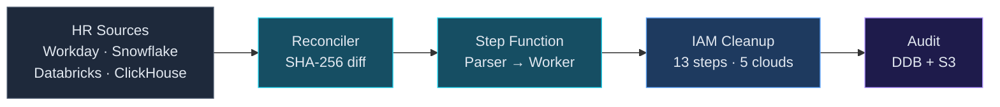
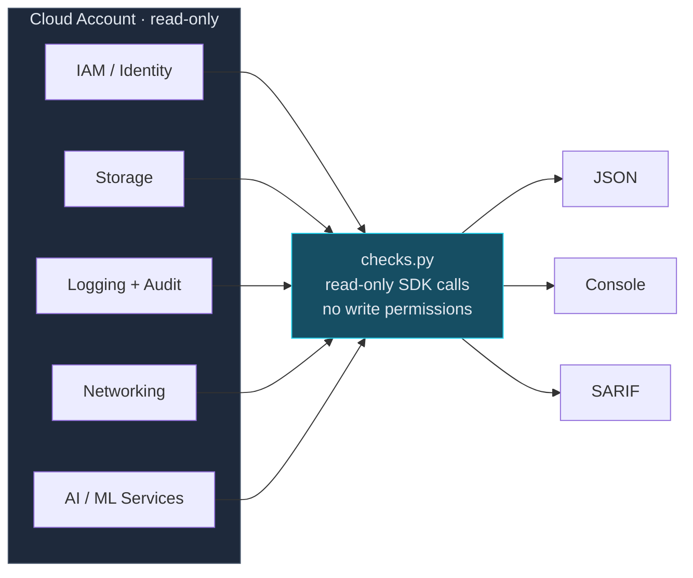
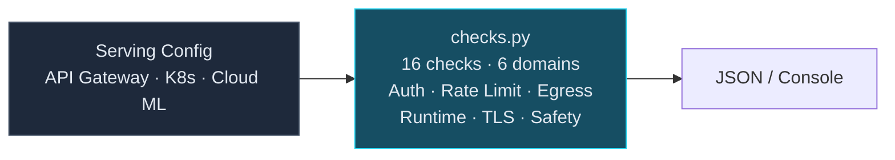
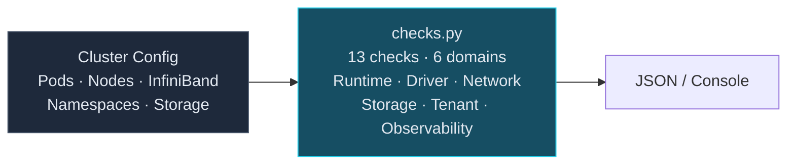
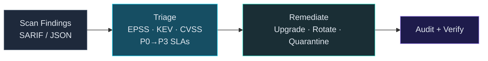
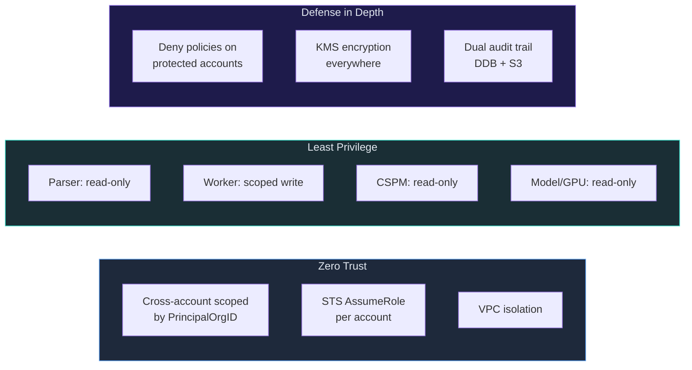

# cloud-security

[](https://github.com/msaad00/cloud-security/actions/workflows/ci.yml)
[](LICENSE)
[](https://www.python.org/downloads/)
[](https://github.com/msaad00/agent-bom)

Production-grade cloud security benchmarks and automation — CIS checks for AWS/GCP/Azure, model serving security, GPU cluster hardening, IAM remediation, and vulnerability response pipelines. Each skill is compliance-mapped, tested, and ready to deploy.

## Skills

| Skill | Scope | Checks | Description |
|-------|-------|--------|-------------|
| [cspm-aws-cis-benchmark](skills/cspm-aws-cis-benchmark/) | AWS | 18 | CIS AWS Foundations v3.0 — IAM, Storage, Logging, Networking |
| [cspm-gcp-cis-benchmark](skills/cspm-gcp-cis-benchmark/) | GCP | 25 | CIS GCP Foundations v3.0 + Vertex AI security |
| [cspm-azure-cis-benchmark](skills/cspm-azure-cis-benchmark/) | Azure | 24 | CIS Azure Foundations v2.1 + AI Foundry security |
| [model-serving-security](skills/model-serving-security/) | Any | 16 | Model endpoint auth, rate limiting, data egress, safety layers |
| [gpu-cluster-security](skills/gpu-cluster-security/) | Any | 13 | GPU runtime isolation, driver CVEs, InfiniBand, tenant isolation |
| [discover-environment](skills/discover-environment/) | Multi-cloud | — | Map cloud resources to security graph with MITRE ATT&CK/ATLAS overlays |
| [iam-departures-remediation](skills/iam-departures-remediation/) | Multi-cloud | — | Auto-remediate IAM for departed employees across 5 clouds |
| [vuln-remediation-pipeline](skills/vuln-remediation-pipeline/) | AWS | — | Auto-remediate supply chain vulns with EPSS triage |

## Architecture — IAM Departures Remediation



## Architecture — CSPM CIS Benchmarks



## Architecture — Model Serving Security



## Architecture — GPU Cluster Security



## Architecture — Vulnerability Remediation Pipeline



## Security Model



## Compliance Framework Mapping

| Framework | Controls | Skills |
|-----------|----------|--------|
| **CIS AWS Foundations v3.0** | 18 controls | cspm-aws |
| **CIS GCP Foundations v3.0** | 20 + 5 Vertex AI | cspm-gcp |
| **CIS Azure Foundations v2.1** | 19 + 5 AI Foundry | cspm-azure |
| **MITRE ATT&CK** | T1078, T1098, T1087, T1195, T1203, T1530, T1599, T1610, T1611 | iam-departures, gpu-cluster |
| **MITRE ATLAS** | AML.T0010, T0024, T0025, T0042, T0048, T0051 | model-serving |
| **NIST CSF 2.0** | PR.AC, PR.DS, DE.CM, DE.AE, RS.MI, ID.RA | All skills |
| **CIS Controls v8** | 5.3, 6.1, 6.2, 6.5, 7.1–7.4, 8.2, 8.5, 13.1, 13.6, 16.1 | iam-departures, vuln-remediation, gpu-cluster |
| **SOC 2 TSC** | CC6.1–CC6.3, CC7.1 | iam-departures, vuln-remediation |
| **ISO 27001:2022** | A.5.15–A.8.24 | cspm-aws, cspm-gcp, cspm-azure |
| **PCI DSS 4.0** | 2.2, 7.1, 8.3, 10.1 | cspm skills |
| **OWASP LLM Top 10** | LLM-05, LLM-07, LLM-08 | vuln-remediation, model-serving |
| **OWASP MCP Top 10** | MCP-04 | vuln-remediation |

## CI/CD Pipeline

This repo is scanned by [agent-bom](https://github.com/msaad00/agent-bom) in CI — dogfooding the scanner against its own security skills.

| CI Job | What |
|--------|------|
| Lint | ruff check + format |
| Test (IAM) | pytest — parser + worker Lambdas |
| Test (Model Serving) | pytest — 31 checks |
| Test (GPU Cluster) | pytest — 31 checks |
| **agent-bom scan** | **SAST + secret detection → SARIF → GitHub Security tab** |
| **agent-bom skills audit** | **SKILL.md security review → SARIF → GitHub Security tab** |
| CloudFormation | cfn-lint validation |
| Terraform | terraform validate |
| Security | bandit + hardcoded secret grep |

## Quick Start

```bash
git clone https://github.com/msaad00/cloud-security.git
cd cloud-security

# AWS CIS benchmark
pip install boto3
python skills/cspm-aws-cis-benchmark/src/checks.py --region us-east-1

# Model serving security audit
python skills/model-serving-security/src/checks.py serving-config.json

# GPU cluster security audit
python skills/gpu-cluster-security/src/checks.py cluster-config.json

# Run tests
pip install pytest boto3 moto
cd skills/iam-departures-remediation && pytest tests/test_parser_lambda.py tests/test_worker_lambda.py -v

# Scan with agent-bom
pip install agent-bom
agent-bom skills scan skills/
agent-bom code skills/
```

## Integration with agent-bom

This repo provides the automations. [agent-bom](https://github.com/msaad00/agent-bom) provides continuous scanning:

| agent-bom Feature | Use Case |
|--------------------|----------|
| `cis_benchmark` | Built-in CIS for AWS/GCP/Azure/Snowflake |
| `code` | SAST scan of Lambda/skill source code |
| `skills scan` | Audit SKILL.md for security risks |
| `blast_radius` | Map impact of orphaned credentials |
| `compliance` | 15-framework compliance posture |
| `graph` | Visualize dependencies + attack paths |

## Contributing

See [CONTRIBUTING.md](CONTRIBUTING.md).

## Security

See [SECURITY.md](SECURITY.md).

## License

[Apache 2.0](LICENSE)
