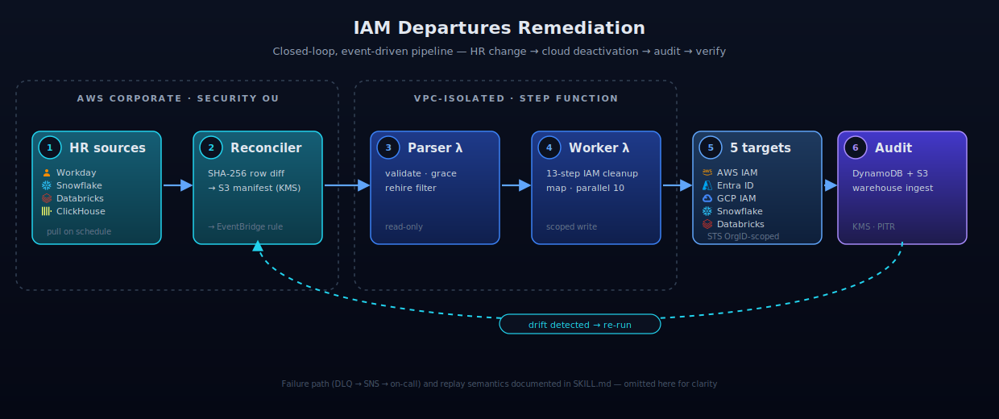

# cloud-ai-security-skills

[](https://github.com/msaad00/cloud-ai-security-skills/actions/workflows/ci.yml?query=branch%3Amain)
[](CHANGELOG.md)
[](LICENSE)
[](https://www.python.org/downloads/)
[](https://schema.ocsf.io/1.8.0)
[](https://github.com/msaad00/agent-bom)

**Security skills for cloud and AI systems, with OCSF as an option instead of a lock-in.** Compose `ingest → discover → detect → evaluate → view → remediate` like Unix pipes. Run the same skill code from the CLI, CI, MCP, or persistent pipelines.

**What it is**
- Cross-cloud and AI security skills, not just CSPM
- Read-only by default, least-privilege, zero-trust
- Deterministic, auditable, and grounded in official vendor docs

## Quick start

**Start here**
- Agents: [AGENTS.md](AGENTS.md)
- Claude Code memory: [CLAUDE.md](CLAUDE.md)
- MCP usage: [docs/agent-integrations.md](docs/agent-integrations.md) and [`.mcp.json`](.mcp.json)
- Architecture and visuals: [docs/ARCHITECTURE.md](docs/ARCHITECTURE.md) and [docs/DIAGRAMS.md](docs/DIAGRAMS.md)
- Runtime isolation and trust boundaries: [docs/RUNTIME_ISOLATION.md](docs/RUNTIME_ISOLATION.md)
- SIEM indexing and dedupe: [docs/SIEM_INDEX_GUIDE.md](docs/SIEM_INDEX_GUIDE.md)
- Schema modes and interoperability: [docs/NATIVE_VS_OCSF.md](docs/NATIVE_VS_OCSF.md)
- Historical state and timeline handling: [docs/STATE_AND_TIMELINE_MODEL.md](docs/STATE_AND_TIMELINE_MODEL.md)
- Coverage and roadmap: [docs/COVERAGE_MODEL.md](docs/COVERAGE_MODEL.md), [docs/framework-coverage.json](docs/framework-coverage.json), and [docs/ROADMAP.md](docs/ROADMAP.md)

| Tool | Best integration path | What to rely on |
|---|---|---|
| **Claude Code** | `CLAUDE.md` + `AGENTS.md` + MCP | project memory + agent rules + tools |
| **Codex** | `AGENTS.md` + MCP | repo rules + tool calling |
| **Cursor** | `AGENTS.md` or `.cursor/rules` + MCP | repo rules + tool calling |
| **Windsurf** | `AGENTS.md` + MCP | directory-scoped agent rules + tools |
| **Cortex Code CLI** | `SKILL.md` / `.cortex/skills` + MCP | native skills + tool calling |

The repo keeps one source of truth:
- `AGENTS.md` for universal agent instructions
- `CLAUDE.md` for Claude-specific project memory
- `SKILL.md` for each skill contract
- MCP as the access layer, not a second implementation

## Flagship workflow



**Visuals**
- [IAM departures cross-cloud workflow](docs/images/iam-departures-architecture.svg)
- [Repo architecture](docs/images/repo-architecture.svg)
- [IAM departures flow](docs/images/iam-departures-data-flow.svg)
- [Detection pipeline](docs/images/detection-pipeline.svg)

```bash
python skills/ingestion/ingest-k8s-audit-ocsf/src/ingest.py audit.log \
  | python skills/detection/detect-privilege-escalation-k8s/src/detect.py \
  | python skills/view/convert-ocsf-to-sarif/src/convert.py \
  > findings.sarif
```

## Layers

| Layer | Role | Output |
|---|---|---|
| **Ingest** | Per-source raw payload → canonical model, with optional OCSF or bridge output | native JSON, canonical JSON, or OCSF API / Network / HTTP / Application Activity |
| **Discover** | point-in-time inventory / graph / evidence / AI BOM | deterministic JSON graph, canonical evidence, OCSF inventory/evidence bridge events, or CycloneDX-aligned BOM |
| **Detect** | canonical or OCSF telemetry → finding + MITRE ATT&CK | Detection Finding (class 2004) or documented native/canonical finding output |
| **Evaluate** | canonical or OCSF telemetry → framework check | Compliance Finding (class 2003) or documented evidence/check output |
| **View** | canonical or OCSF → SARIF / Mermaid / graph | GitHub Security tab, PR comments, dashboards |
| **Remediate** | Finding → action (HITL-gated, audited) | Dual-write audit row |

Each skill is a standalone Python bundle following [Anthropic's skill spec](https://platform.claude.com/docs/en/build-with-claude/skills-guide): `SKILL.md`, `src/`, `tests/`, `REFERENCES.md`, explicit `Use when...`, and explicit `Do NOT use...`.

**Schema mode note**
- the repo supports `native`, `canonical`, `ocsf`, and `bridge` modes
- `ingest`, `detect`, `evaluate`, and `view` remain OCSF-friendly, but OCSF is optional rather than mandatory
- `discovery` prefers native OCSF inventory/evidence classes and profiles when they fit, and otherwise uses deterministic native or bridge artifacts
- `discover-environment` supports an `ocsf-cloud-resources-inventory` bridge mode
- discovery evidence skills support an `ocsf-live-evidence` bridge mode for Discovery-category OCSF workflows
- the stable repo contract is now: preserve source truth, normalize into a canonical internal model, then emit `native`, `ocsf`, or `bridge` output as appropriate

See [`docs/ARCHITECTURE.md`](docs/ARCHITECTURE.md) for the full layered design, [`docs/NATIVE_VS_OCSF.md`](docs/NATIVE_VS_OCSF.md) for schema-mode selection, [`docs/STATE_AND_TIMELINE_MODEL.md`](docs/STATE_AND_TIMELINE_MODEL.md) for historical-state handling, and [`docs/DIAGRAMS.md`](docs/DIAGRAMS.md) for the visual set.

## How it runs

| Mode | Driver | Best for | Human approval |
|---|---|---|---|
| **CLI / just-in-time** | Operator or agent runs a skill directly | triage, local analysis, one-off conversions, golden-fixture checks | only for write-capable skills |
| **CI** | GitHub Actions or another pipeline | regression testing, policy checks, compliance snapshots, SARIF generation | never for read-only skills |
| **Persistent / serverless** | runner, queue, EventBridge, Step Functions, scheduled jobs | continuous detection, remediation pipelines, lake ingestion | required for destructive actions |
| **MCP** | local `mcp-server/` wrapper | Claude, Codex, Cursor, Windsurf, Cortex Code CLI | inherited from the wrapped skill |

The important rule is that the **skill code does not change between modes**. `SKILL.md + src/ + tests/` stays the product; the runner, pipeline, or MCP wrapper is only the access path.

## Safety model

| Skill type | Default posture | Required controls |
|---|---|---|
| **Ingest / detect / evaluate / view** | read-only | deterministic output, no hidden writes, official references only |
| **Discovery / inventory / enrich** | read-only unless explicitly documented otherwise | schema validation, output contracts, no secret leakage |
| **Remediation** | dry-run first | least privilege, blast-radius docs, audit trail, HITL gate |
| **Sinks / runners** | side-effectful edge components | idempotency, merge-on-UID, transport security, checkpointing |

For every shipped skill, the contract is:
- exact input and output format
- explicit `Use when...` and `Do NOT use...`
- official vendor docs only in `REFERENCES.md`
- failure-safe behavior on malformed input and deprecated API shapes
- no generic shell, SQL, or network passthrough

## Agent docs

| File | Scope | Use it for |
|---|---|---|
| [`README.md`](README.md) | public repo overview | what the repo is, how it is positioned, where to start |
| [`AGENTS.md`](AGENTS.md) | cross-agent repo contract | Codex, Cursor, Windsurf, Cortex, Claude, generic AGENTS.md-aware tools |
| [`CLAUDE.md`](CLAUDE.md) | Claude Code project memory | repo-wide Claude defaults and working rules |
| `skills/<layer>/<skill>/SKILL.md` | individual skill contract | when to use a skill, input/output, blast radius, non-goals |
| `skills/<layer>/<skill>/REFERENCES.md` | source-of-truth references | official docs, schemas, APIs, benchmarks |

## Coverage

<details>
<summary><b>Skills shipped today</b></summary>

```
skills/
├── ingestion/                      "Raw source → OCSF 1.8"
│   ├── ingest-cloudtrail-ocsf      AWS            → API Activity 6003
│   ├── ingest-vpc-flow-logs-ocsf   AWS            → Network Activity 4001
│   ├── ingest-vpc-flow-logs-gcp-ocsf GCP          → Network Activity 4001
│   ├── ingest-nsg-flow-logs-azure-ocsf Azure      → Network Activity 4001
│   ├── ingest-guardduty-ocsf       AWS            → Detection Finding 2004
│   ├── ingest-security-hub-ocsf    AWS            → Findings 2004 passthrough
│   ├── ingest-gcp-scc-ocsf         GCP            → Findings 2004 passthrough
│   ├── ingest-azure-defender-for-cloud-ocsf Azure → Findings 2004 passthrough
│   ├── ingest-gcp-audit-ocsf       GCP            → API Activity 6003
│   ├── ingest-azure-activity-ocsf  Azure          → API Activity 6003
│   ├── ingest-okta-system-log-ocsf Okta           → IAM 3002 / 3001 / 3005
│   ├── ingest-google-workspace-login-ocsf Workspace → IAM 3002 / 3001
│   ├── ingest-k8s-audit-ocsf       K8s            → API Activity 6003
│   └── ingest-mcp-proxy-ocsf       MCP            → Application Activity 6002
│
├── discovery/                      "Point-in-time inventory and graph evidence"
│   ├── discover-environment                      → graph JSON or OCSF 5023 inventory bridge
│   ├── discover-ai-bom                           → CycloneDX-aligned AI BOM
│   ├── discover-control-evidence                 → PCI / SOC 2 technical evidence JSON
│   └── discover-cloud-control-evidence           → Cross-cloud PCI / SOC 2 evidence JSON
│
├── detection/                      "What attack pattern does this event stream show?"
│   ├── detect-lateral-movement                    → T1021 / T1078.004 cross-cloud pivot
│   ├── detect-okta-mfa-fatigue                    → T1621 Okta Verify push fatigue
│   ├── detect-mcp-tool-drift                      → T1195.001 Supply Chain
│   ├── detect-privilege-escalation-k8s            → T1552.007 / T1611 / T1098 / T1550.001
│   └── detect-sensitive-secret-read-k8s           → T1552.007 Container API
│
├── evaluation/                     "Does this align with a benchmark or posture bar?"
│   ├── cspm-aws-cis-benchmark      (CIS AWS Foundations v3.0 — 18 checks)
│   ├── cspm-gcp-cis-benchmark      (CIS GCP Foundations v3.0 — 7 checks)
│   ├── cspm-azure-cis-benchmark    (CIS Azure Foundations v2.1 — 6 checks)
│   ├── k8s-security-benchmark      (CIS Kubernetes — 10 checks)
│   ├── container-security          (CIS Docker — 8 checks)
│   ├── model-serving-security      (20 checks — auth / rate limit / egress / network / safety)
│   └── gpu-cluster-security        (13 checks — runtime / driver / tenant isolation)
│
├── view/                           "OCSF → reviewable output"
│   ├── convert-ocsf-to-sarif                      → GitHub Security tab
│   └── convert-ocsf-to-mermaid-attack-flow        → PR comments
│
└── remediation/                    "Fix it, gated and audited"
    └── iam-departures-remediation  (event-driven, DLQ + SNS, dual audit)
```

**Roadmap:** current open issues focus on AWS Config and deeper evaluation coverage, richer MCP input schemas and transports, additional cloud and AI service coverage, vendor stories, and deeper discovery / inventory follow-ons beyond the first AI BOM and evidence capabilities.

</details>

## Security & trust

This is a security tool. Trustworthiness is the first feature, not an afterthought. Eleven principles pinned in [`SECURITY_BAR.md`](SECURITY_BAR.md), every skill graded against every principle.

<details>
<summary><b>The eleven principles</b></summary>

| # | Principle | What it means |
|---|---|---|
| 1 | **Read-only by default** | Posture + detection NEVER call write APIs. Remediation isolates the write path behind explicit IAM grants and dry-run defaults. |
| 2 | **Agentless** | No daemons, no sidecars, no continuously running processes. Short-lived Python scripts that read what's already there. |
| 3 | **Least privilege** | Each skill documents the EXACT IAM / RBAC permissions it needs in `REFERENCES.md`. Minimal set only. |
| 4 | **Defense in depth** | Posture + detection + remediation + audit + re-verify all run in parallel and back each other up. |
| 5 | **Closed loop** | Every workflow has a verification step: detect → finding → action → audit → re-verify. Drift is itself a detection. |
| 6 | **OCSF on the wire** | All ingest + detect skills speak OCSF 1.8 JSONL. MITRE ATT&CK lives inside `finding_info.attacks[]`. |
| 7 | **Secure by design** | Security is a first-class input to the skill's architecture, not a bolt-on. |
| 8 | **Secure code** | Defensive parsing on every input boundary. No `eval`/`exec`/`pickle.loads` on untrusted data. Parameterised SQL only. `bandit` in CI. |
| 9 | **Secure secrets & tokens** | No hardcoded creds. Secrets from cloud secret stores. Short-lived tokens. Logs scrub creds. CI greps for `AKIA` / `sk-` / `ghp_` patterns. |
| 10 | **No telemetry** | No phone-home. Findings stay local unless the operator explicitly forwards them. |
| 11 | **HITL, no rogue behaviour** | A skill never escalates its own privileges, never bypasses guardrails, never invokes siblings it wasn't composed with. Destructive actions require HITL gates. |

</details>

<details>
<summary><b>How trust is verified</b></summary>

| Check | What it catches | Where it runs |
|---|---|---|
| **Golden-fixture deep-eq** | Silent detection-coverage regressions after a refactor | Per-skill `pytest` — `tests/test_*.py::TestGoldenFixture` |
| **Wire-contract tests** | Off-spec events, wrong `class_uid`, missing required fields, `attacks[]` at the wrong level | Cross-skill assertions pinned in [`OCSF_CONTRACT.md`](skills/detection-engineering/OCSF_CONTRACT.md) |
| **End-to-end pipes** | Breakage across the `ingest → detect → convert` chain | `tests/integration/` — deep-eq against frozen SARIF + Mermaid |
| **Static analysis** | Unsafe parsing, missing imports, style drift | `ruff check` + `ruff format --check` + `bandit` on every PR |
| **Hardcoded-secret grep** | Leaked `AKIA…` / `sk-…` / `ghp_…` tokens before they ship | CI lint job, repo-wide on every push |
| **`REFERENCES.md` per skill** | Fabricated APIs, opaque dependencies, undocumented IAM | Presence enforced by CI; manual review on new skills |
| **Skill integrity validator** | Name drift, MCP metadata drift, unapproved reference domains, dangerous runtime patterns | `scripts/validate_skill_integrity.py` in CI and integration tests |
| **`agent-bom` scans** | Vulnerable deps, IaC misconfig, shadow AI components | `code` / `skills scan` / `fs` / `iac` on every push; findings land in GitHub Security tab under `agent-bom-iac` |

</details>

## Related docs

| Document | Purpose |
|---|---|
| [`ARCHITECTURE.md`](docs/ARCHITECTURE.md) | 9-layer design, two execution modes (stateless + persistent), 10 guardrails |
| [`DIAGRAMS.md`](docs/DIAGRAMS.md) | Architecture map, IAM departures workflow/data flow, and detection pipeline visuals |
| [`CI_WORKFLOW.md`](docs/CI_WORKFLOW.md) | CI lane layout, dedupe rules, and follow-up simplification plan |
| [`CHANGELOG.md`](CHANGELOG.md) | Repo-level release notes and material skill changes |
| [`COVERAGE_MODEL.md`](docs/COVERAGE_MODEL.md) | What framework coverage means and how it is measured |
| [`framework-coverage.json`](docs/framework-coverage.json) | Machine-readable framework, provider, and asset coverage registry |
| [`FRAMEWORK_MAPPINGS.md`](docs/FRAMEWORK_MAPPINGS.md) | Where ATT&CK, ATLAS, CIS, NIST, OWASP, SOC 2, ISO, and PCI coverage lives today |
| [`ROADMAP.md`](docs/ROADMAP.md) | Coverage and execution roadmap for cloud, AI, and framework depth |
| [`RUNTIME_ISOLATION.md`](docs/RUNTIME_ISOLATION.md) | Sandbox, credential, transport, integrity, and approval guidance by execution mode |
| [`SIEM_INDEX_GUIDE.md`](docs/SIEM_INDEX_GUIDE.md) | Index fields, dedupe keys, timestamps, and transport guidance for OCSF consumers |
| [`mcp-server/README.md`](mcp-server/README.md) | Thin local MCP wrapper for auto-discovered skills |
| [`DEPENDENCY_HYGIENE_SKILL.md`](docs/DEPENDENCY_HYGIENE_SKILL.md) | Proposed safe dependency-update skill contract |
| [`SKILL_CONTRACT.md`](docs/SKILL_CONTRACT.md) | Minimum files, metadata, and guardrails for shipped skills |
| [`OCSF_CONTRACT.md`](skills/detection-engineering/OCSF_CONTRACT.md) | Wire format pinning for OCSF 1.8 + MITRE ATT&CK v14 |
| [`SECURITY_BAR.md`](SECURITY_BAR.md) | Per-principle verification matrix — every skill graded against every principle |
| [`SECURITY.md`](SECURITY.md) | Coordinated disclosure policy |
| [`docs/agent-integrations.md`](docs/agent-integrations.md) | How Claude, Codex CLI, and AGENTS.md-aware tools should use this repo today |
| [`CONTRIBUTING.md`](CONTRIBUTING.md) | How to add a new skill |

## Contributing

New skills land as standalone bundles. The checklist:

1. **Pick a layer** — ingest, discover, enrich, detect, evaluate, remediate, or convert
2. **Copy the nearest sibling** — the existing skills in the target category are the canonical reference layout
3. **Ship the bundle** — `SKILL.md` with a `Do NOT use…` clause, `src/<entry>.py`, `tests/test_<entry>.py`, golden fixtures under `skills/detection-engineering/golden/` when the skill speaks OCSF, and `REFERENCES.md` listing every official doc the skill depends on
4. **Add a row** to the [`SECURITY_BAR.md`](SECURITY_BAR.md) matrix
5. **Wire into CI** — add the skill to the right matrix cell in [`.github/workflows/ci.yml`](.github/workflows/ci.yml)
6. **Open a PR** — [`ARCHITECTURE.md`](docs/ARCHITECTURE.md) is the review contract; make sure your skill satisfies every applicable guardrail

See [`CONTRIBUTING.md`](CONTRIBUTING.md) for the full guide.

## License

[Apache 2.0](LICENSE) — use it, fork it, ship it. Security research is welcome; see [`SECURITY.md`](SECURITY.md) for coordinated disclosure.
