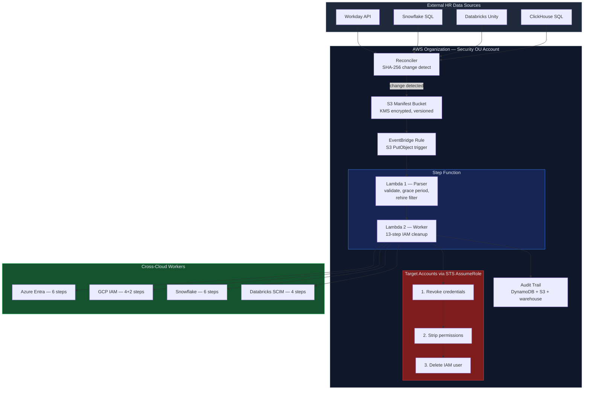
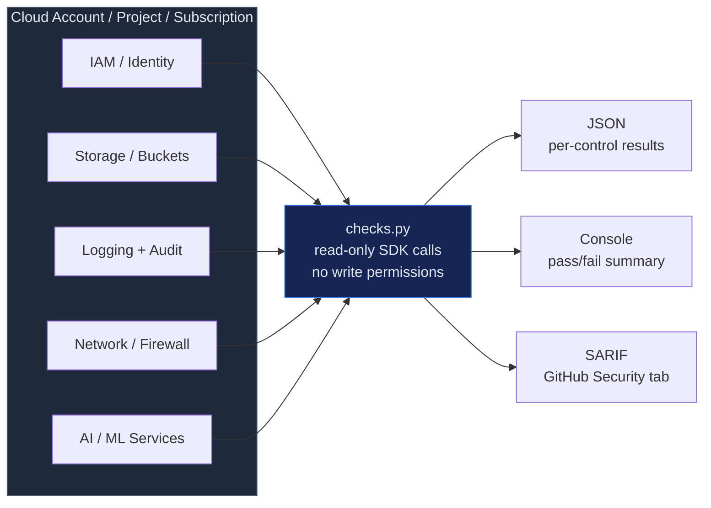
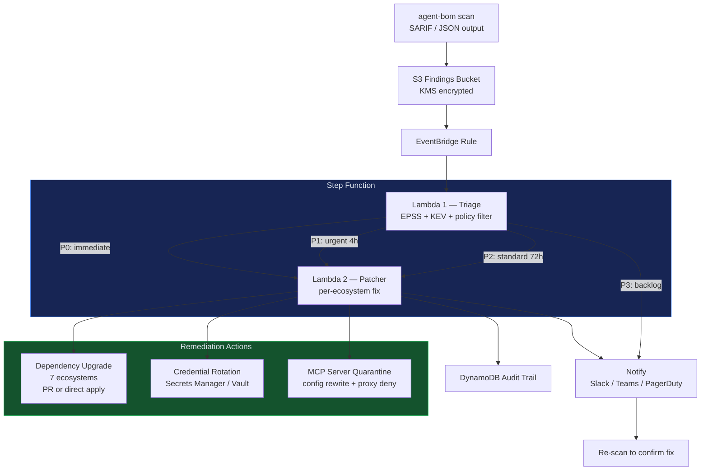
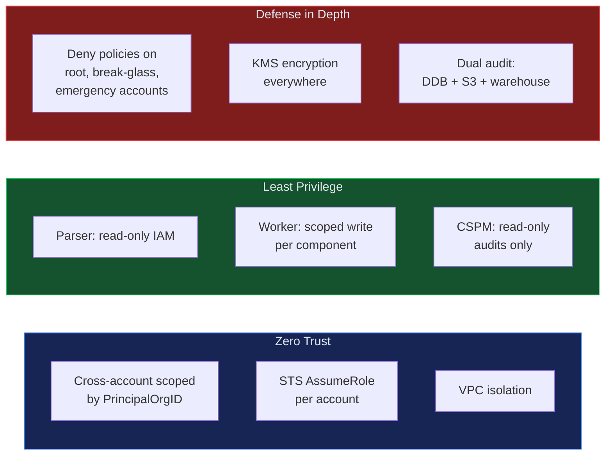

# cloud-security

[](https://github.com/msaad00/cloud-security/actions/workflows/ci.yml)
[](LICENSE)
[](https://www.python.org/downloads/)

Production-ready cloud security automations — deployable code, CIS benchmark assessments, multi-cloud identity remediation, and compliance-mapped skills for AI agents.

## Skills

| Skill | Cloud | Status | Description |
|-------|-------|--------|-------------|
| [iam-departures-remediation](skills/iam-departures-remediation/) | AWS + 4 clouds | Production | Auto-remediate IAM for departed employees — 4 HR sources, 5 cloud targets, 13-step cleanup |
| [cspm-aws-cis-benchmark](skills/cspm-aws-cis-benchmark/) | AWS | Production | CIS AWS Foundations v3.0 — 18 automated checks across IAM, Storage, Logging, Networking |
| [cspm-gcp-cis-benchmark](skills/cspm-gcp-cis-benchmark/) | GCP | Production | CIS GCP Foundations v3.0 — 20 controls + 5 Vertex AI security checks |
| [cspm-azure-cis-benchmark](skills/cspm-azure-cis-benchmark/) | Azure | Production | CIS Azure Foundations v2.1 — 19 controls + 5 AI Foundry security checks |
| [model-serving-security](skills/model-serving-security/) | Any | Production | Model serving security benchmark — 16 checks across auth, rate limiting, data egress, container isolation, TLS, safety layers |
| [gpu-cluster-security](skills/gpu-cluster-security/) | Any | Production | GPU cluster security benchmark — 13 checks across runtime isolation, driver CVEs, InfiniBand, tenant isolation, DCGM |
| [vuln-remediation-pipeline](skills/vuln-remediation-pipeline/) | AWS | Production | Auto-remediate supply chain vulns — EPSS triage, dependency PRs, credential rotation, MCP quarantine |

## Architecture — IAM Departures Remediation



## Architecture — CSPM CIS Benchmarks



## Architecture — Vulnerability Remediation Pipeline



## What's Inside

### iam-departures-remediation

Fully deployable automation that reconciles HR termination data against cloud IAM and safely removes departed-employee access.

**Pipeline**: HR source -> Reconciler -> S3 manifest -> EventBridge -> Step Function -> Parser Lambda -> Worker Lambda -> Target Accounts

<details>
<summary><b>Components</b></summary>

| Component | Path | What It Does |
|-----------|------|-------------|
| **Reconciler** | `src/reconciler/` | Ingests from 4 HR sources, SHA-256 change detection, KMS-encrypted S3 export |
| **Parser Lambda** | `src/lambda_parser/` | Validates manifest, grace period checks, rehire filtering, IAM existence verification |
| **Worker Lambda** | `src/lambda_worker/` | 13-step IAM dependency cleanup + deletion, cross-account STS |
| **Multi-Cloud Workers** | `src/lambda_worker/clouds/` | Azure Entra, GCP IAM, Snowflake, Databricks SCIM |
| **CloudFormation** | `infra/cloudformation.yaml` | Full stack: roles, Lambdas, Step Function, S3, DynamoDB |
| **StackSets** | `infra/cross_account_stackset.yaml` | Org-wide cross-account remediation role |
| **IAM Policies** | `infra/iam_policies/` | Least-privilege policy documents per component |
| **Terraform** | `infra/terraform/` | HCL alternative to CloudFormation |
| **Tests** | `tests/` | Unit tests covering parser, worker, reconciler, cross-cloud |

</details>

### cspm-aws-cis-benchmark

18 automated checks against CIS AWS Foundations v3.0. Each control mapped to NIST CSF 2.0 and ISO 27001:2022.

```bash
python skills/cspm-aws-cis-benchmark/src/checks.py --region us-east-1
```

<details>
<summary><b>Controls covered</b></summary>

| Section | # Checks | Key Controls |
|---------|----------|-------------|
| IAM | 7 | Root MFA, user MFA, stale creds, key rotation, password policy, root keys, inline policies |
| Storage | 4 | S3 encryption, logging, public access block, versioning |
| Logging | 4 | CloudTrail multi-region, log validation, trail S3 not public, CloudWatch alarms |
| Networking | 3 | No unrestricted SSH/RDP, VPC flow logs |

</details>

### cspm-gcp-cis-benchmark

20 CIS GCP Foundations v3.0 controls + 5 Vertex AI security checks.

```bash
python skills/cspm-gcp-cis-benchmark/src/checks.py --project my-project-id
```

<details>
<summary><b>Controls covered</b></summary>

| Section | # Checks | Key Controls |
|---------|----------|-------------|
| IAM | 7 | No Gmail accounts, MFA, no SA keys, key rotation, default SA, SSH keys, impersonation |
| Storage | 4 | Uniform access, retention, no public buckets, CMEK |
| Logging | 4 | Audit logs, log sinks, retention, alert policies |
| Networking | 5 | No default VPC, no open SSH/RDP, flow logs, Private Google Access, TLS 1.2+ |
| Vertex AI | 5 | Endpoint auth, VPC-SC, CMEK training data, model audit, no public endpoints |

</details>

### cspm-azure-cis-benchmark

19 CIS Azure Foundations v2.1 controls + 5 Azure AI Foundry security checks.

```bash
python skills/cspm-azure-cis-benchmark/src/checks.py --subscription-id SUB_ID
```

<details>
<summary><b>Controls covered</b></summary>

| Section | # Checks | Key Controls |
|---------|----------|-------------|
| Identity | 7 | MFA, Conditional Access, guest privileges, custom roles, legacy auth, PIM |
| Storage | 4 | Encryption, HTTPS-only, no public blobs, deny-by-default network rules |
| Logging | 4 | Activity log retention, diagnostic settings, RBAC alerts, Monitor log profile |
| Networking | 4 | No open SSH/RDP, NSG flow logs, Network Watcher |
| AI Foundry | 5 | Managed identity auth, private endpoints, CMK, content safety, diagnostic logging |

</details>

### vuln-remediation-pipeline

Auto-remediate supply chain vulnerabilities found by [agent-bom](https://github.com/msaad00/agent-bom) — from scan findings to patched dependencies, rotated credentials, and quarantined MCP servers.

```bash
# Scan and export findings for the pipeline
agent-bom scan -f sarif -o findings.sarif --enrich --fail-on-kev

# Upload to S3 trigger bucket
aws s3 cp findings.sarif s3://vuln-remediation-findings/incoming/
```

<details>
<summary><b>Triage tiers</b></summary>

| Tier | Criteria | SLA | Action |
|------|----------|-----|--------|
| P0 | CISA KEV or CVSS >= 9.0 | 1h | Auto-patch + quarantine if needed |
| P1 | CVSS >= 7.0 AND EPSS > 0.7 | 4h | Auto-patch, PR if risky |
| P2 | CVSS >= 4.0 OR EPSS > 0.3 | 72h | Create PR for review |
| P3 | CVSS < 4.0 AND EPSS < 0.3 | 30d | Notify, add to backlog |

</details>

## Security Model



## Compliance Framework Mapping

| Framework | Controls Covered | Where |
|-----------|-----------------|-------|
| **CIS AWS Foundations v3.0** | 18 controls (IAM, S3, CloudTrail, VPC) | `cspm-aws-cis-benchmark/` |
| **CIS GCP Foundations v3.0** | 20 controls + 5 Vertex AI | `cspm-gcp-cis-benchmark/` |
| **CIS Azure Foundations v2.1** | 19 controls + 5 AI Foundry | `cspm-azure-cis-benchmark/` |
| **MITRE ATT&CK** | T1078.004, T1098.001, T1087.004, T1531, T1552, T1195.002, T1210 | Lambda docstrings |
| **NIST CSF 2.0** | PR.AC-1, PR.AC-4, DE.CM-3, RS.MI-2 | Lambda docstrings |
| **CIS Controls v8** | 5.3, 6.1, 6.2, 6.5, 7.1, 7.2, 7.3, 7.4, 16.1 | Worker + Patcher Lambdas |
| **SOC 2 TSC** | CC6.1, CC6.2, CC6.3, CC7.1 | Worker + Triage Lambdas |
| **ISO 27001:2022** | A.5.15-A.8.24 (12 controls) | CSPM check scripts |
| **PCI DSS 4.0** | 2.2, 7.1, 8.3, 10.1 | CSPM check scripts |
| **OWASP LLM Top 10** | LLM-05, LLM-07, LLM-08 | vuln-remediation-pipeline |
| **OWASP MCP Top 10** | MCP-04 | vuln-remediation-pipeline |

## Multi-Cloud Support

| Cloud | Skill | Cleanup / Check Steps | API |
|-------|-------|----------------------|-----|
| **AWS IAM** | iam-departures + cspm-aws | 13-step cleanup + 18 CIS checks | boto3 |
| **Azure** | iam-departures + cspm-azure | 6-step Entra cleanup + 19 CIS checks | msgraph-sdk, azure-mgmt |
| **GCP** | iam-departures + cspm-gcp | 4+2 step cleanup + 20 CIS checks | google-cloud-iam |
| **Snowflake** | iam-departures | 6 steps (disable, drop roles, revoke, drop user) | SQL DDL |
| **Databricks** | iam-departures | 4 steps (deactivate, remove groups, revoke tokens, delete) | SCIM API |

## Quick Start

```bash
# Clone
git clone https://github.com/msaad00/cloud-security.git
cd cloud-security

# Run AWS CIS benchmark
pip install boto3
python skills/cspm-aws-cis-benchmark/src/checks.py --region us-east-1

# Run GCP CIS benchmark
pip install google-cloud-iam google-cloud-storage google-cloud-compute
python skills/cspm-gcp-cis-benchmark/src/checks.py --project my-project

# Run Azure CIS benchmark
pip install azure-identity azure-mgmt-authorization azure-mgmt-storage azure-mgmt-monitor azure-mgmt-network
python skills/cspm-azure-cis-benchmark/src/checks.py --subscription-id SUB_ID

# Run IAM departures tests
cd skills/iam-departures-remediation
pip install boto3 moto pytest
pytest tests/ -v

# Validate with agent-bom
pip install agent-bom
agent-bom skills scan skills/
```

## Integration with agent-bom

This repo provides the security automations. [agent-bom](https://github.com/msaad00/agent-bom) provides continuous scanning and compliance validation:

| agent-bom Feature | Use Case |
|--------------------|----------|
| `cis_benchmark` | Built-in CIS checks for AWS/GCP/Azure/Snowflake (continuous monitoring) |
| `scan --aws` | Discover Lambda dependencies, check for CVEs |
| `blast_radius` | Map impact of orphaned IAM credentials |
| `compliance` | 15-framework compliance posture check |
| `policy_check` | Policy-as-code gates for CI/CD |
| `skills scan` | Scan skill files for security risks |
| `graph` | Visualize cloud resource dependencies + attack paths |

## Contributing

See [CONTRIBUTING.md](CONTRIBUTING.md) for guidelines on adding new skills.

## Security

See [SECURITY.md](SECURITY.md) for vulnerability reporting policy.

## License

[Apache 2.0](LICENSE)
