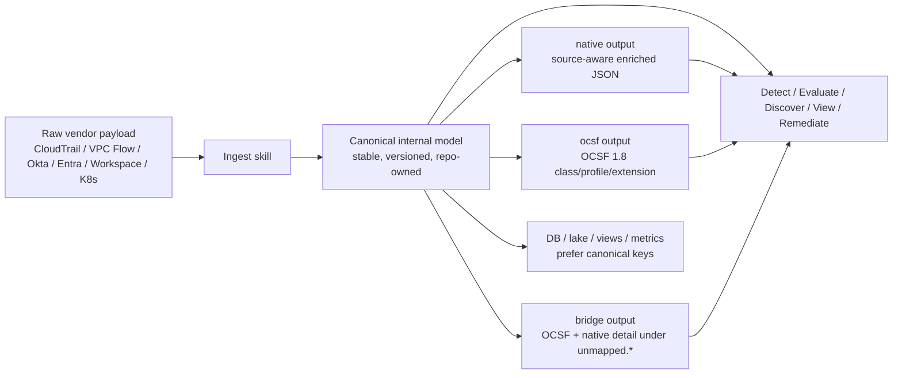

# Data Flow

This repo supports raw-source fidelity, a stable canonical model, and optional
OCSF interoperability.

## Layer view

| Layer | Typical input | Canonical role | Typical output |
|---|---|---|---|
| Ingestion | raw | normalize source truth | native, ocsf, bridge |
| Discovery | raw, canonical | inventory / evidence / BOM | native, bridge |
| Detection | canonical, ocsf, documented native | finding correlation | native or ocsf |
| Evaluation | raw, canonical, ocsf | control / benchmark result | native |
| View | canonical or ocsf | delivery conversion | native artifact |
| Remediation | raw, canonical | action planning / execution state | native audit/result |

## Current rollout

Dual-mode is now rolling out skill-by-skill rather than landing as a one-shot
repo rewrite.

Current source of truth:

- the `README.md` schema-mode section lists every currently dual-mode skill
- each skill's `SKILL.md` frontmatter declares the supported `input_formats`
  and `output_formats`
- `validate_skill_contract.py` enforces that those declarations are present

Native-first with optional bridge today:

- `discover-environment`
- `discover-control-evidence`
- `discover-cloud-control-evidence`

Everything else declares its supported formats explicitly and can be rolled into
the same canonical projection pattern without changing the repo contract.
