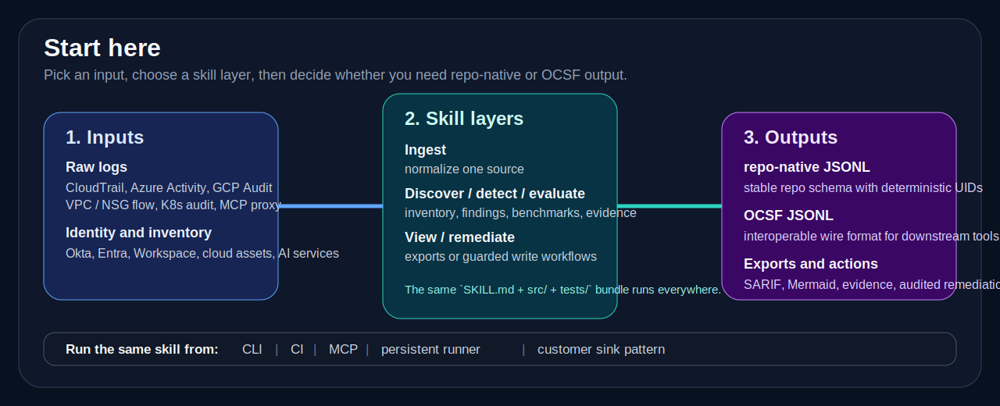

# Use Cases and Skill Selection

This guide answers the practical question first: **what are you trying to do, and which skill should you start with?**

Use it when the README feels too high-level and `skills/README.md` feels too catalog-like.

## Start by goal

| Goal | Start with | Common sources | Asset focus | Typical output |
|---|---|---|---|---|
| Normalize one raw log source | source-specific `ingest-*` skill | CloudTrail, Azure Activity, GCP Audit, VPC Flow, K8s audit, Okta, Entra, Workspace, MCP proxy | identities, API activity, network, app activity | native or OCSF JSONL |
| Detect suspicious behavior in event streams | `ingest-*` + matching `detect-*` | identity, network, K8s, MCP, workspace auth | users, service principals, sessions, secrets, east-west traffic | Detection Finding (OCSF 2004) or native finding |
| Benchmark security posture | `evaluation/*` | live cloud APIs and control-plane state | accounts, policies, clusters, containers, GPUs, model endpoints | posture or compliance results |
| Inventory cloud or AI assets | `discover-environment` or `discover-ai-bom` | live cloud APIs, AI service inventories | resources, graphs, AI endpoints, registries, datasets | inventory graph or CycloneDX-aligned AI BOM |
| Build audit evidence | `discover-control-evidence` or `discover-cloud-control-evidence` | discovery output and live inventory | controls, settings, evidence artifacts | evidence JSON or OCSF bridge |
| Centralize remediation audit in your own lakehouse | `iam-departures-remediation` plus a customer-owned sink pattern | IAM departures workflow audit rows | identities, approvals, actions, audit history | DynamoDB + S3 today, external sink pattern via Snowflake / Snowpipe or another lakehouse later |
| Export findings to downstream tools | `view/*` | OCSF findings | detections and evidence | SARIF, Mermaid attack flow |
| Remediate offboarding safely | `iam-departures-remediation` | HR departure feeds + cloud / data-platform APIs | users, IAM identities, warehouse identities | dry-run plan or audited remediation |

<b>Expanded selection tables</b>

## Start by source

| Source / vendor | First skill | Typical next skill |
|---|---|---|
| AWS CloudTrail | `ingest-cloudtrail-ocsf` | `detect-lateral-movement` |
| AWS VPC Flow Logs | `ingest-vpc-flow-logs-ocsf` | `detect-lateral-movement` |
| Azure Activity Logs | `ingest-azure-activity-ocsf` | `detect-lateral-movement` |
| GCP Audit Logs | `ingest-gcp-audit-ocsf` | `detect-lateral-movement` |
| Kubernetes audit logs | `ingest-k8s-audit-ocsf` | `detect-privilege-escalation-k8s` or `detect-sensitive-secret-read-k8s` |
| Okta System Log | `ingest-okta-system-log-ocsf` | `detect-okta-mfa-fatigue` |
| Microsoft Entra / Graph `directoryAudit` | `ingest-entra-directory-audit-ocsf` | `detect-entra-credential-addition` or `detect-entra-role-grant-escalation` |
| Google Workspace login audit | `ingest-google-workspace-login-ocsf` | `detect-google-workspace-suspicious-login` |
| MCP proxy activity | `ingest-mcp-proxy-ocsf` | `detect-mcp-tool-drift` |
| GuardDuty / Security Hub / SCC / Defender | source-specific `ingest-*` finding ingester | `view/*` or SIEM export |

## Start by asset class

| Asset class | Best starting layer | Skills to look at first |
|---|---|---|
| Human identities | ingest / detect | Okta, Entra, Workspace, CloudTrail identity paths |
| Service principals / app credentials | ingest / detect | Entra ingest + Entra credential / role detectors |
| Cloud API activity | ingest / detect / evaluate | CloudTrail, Azure Activity, GCP Audit, CSPM skills |
| Network activity | ingest / detect | VPC / NSG flow ingesters + `detect-lateral-movement` |
| Kubernetes workloads and secrets | ingest / detect / evaluate | K8s audit ingester, K8s detectors, K8s benchmark |
| Containers and GPU clusters | evaluate | `container-security`, `gpu-cluster-security` |
| AI services and model endpoints | discover / evaluate | `discover-ai-bom`, `discover-environment`, `model-serving-security` |
| Audit evidence and control state | discovery | `discover-control-evidence`, `discover-cloud-control-evidence` |
| Offboarding / access cleanup | remediation | `iam-departures-remediation` |

## Start by framework

| Framework need | Start here |
|---|---|
| OCSF transport and interoperability | [NATIVE_VS_OCSF.md](NATIVE_VS_OCSF.md), [CANONICAL_SCHEMA.md](CANONICAL_SCHEMA.md), [NORMALIZATION_REFERENCE.md](NORMALIZATION_REFERENCE.md), [DATA_FLOW.md](DATA_FLOW.md) |
| MITRE ATT&CK / ATLAS mapping | [FRAMEWORK_MAPPINGS.md](FRAMEWORK_MAPPINGS.md) |
| Coverage depth and current status | [framework-coverage.json](framework-coverage.json), [COVERAGE_MODEL.md](COVERAGE_MODEL.md) |
| Compliance and roadmap gaps | [ROADMAP.md](ROADMAP.md) |

## What it plugs into

| Surface | Use it for |
|---|---|
| CLI / Unix pipes | direct local analysis and reproducible pipelines |
| MCP | Claude, Codex, Cursor, Windsurf, Cortex Code CLI |
| CI | scheduled checks, PR gates, SARIF generation |
| SIEM / lakehouse | normalized event, finding, evidence, and customer-controlled audit ingestion |
| Serverless / persistent runners | event-driven or scheduled operation around the same stateless skills |

## What is shipped vs planned

| Topic | Shipped today | Planned / contract-supported |
|---|---|---|
| Native / OCSF dual mode | selected ingest and detect skills, plus native-first discovery | repo-wide rollout across remaining ingest/detect paths |
| Persistent execution | IAM departures event-driven path, plus `runners/aws-s3-sqs-detect` | broader multi-sink and multi-cloud runner coverage |
| Audit sinks | IAM departures dual-write to DynamoDB + S3 | external customer sinks like Snowflake / Snowpipe, Security Lake, ClickHouse, BigQuery |
| Visuals | repo architecture, detection pipeline, IAM departures workflow + data flow | deeper source / asset / plug-in visuals as the surface grows |

<b>Read next</b>

## Read next

- Need the big picture: [ARCHITECTURE.md](ARCHITECTURE.md)
- Need the skill inventory: [../skills/README.md](../skills/README.md)
- Need trust and runtime controls: [RUNTIME_ISOLATION.md](RUNTIME_ISOLATION.md)
- Need troubleshooting: [DEBUGGING.md](DEBUGGING.md) and [TROUBLESHOOTING.md](TROUBLESHOOTING.md)

