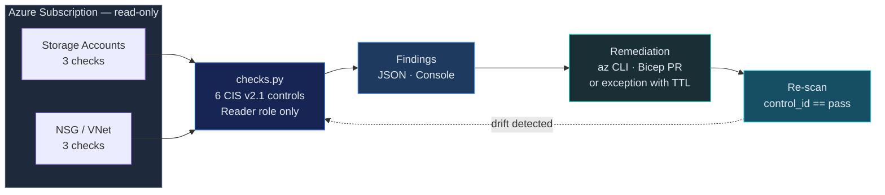

# CSPM — Azure CIS Foundations Benchmark v2.1 (subset)

Automated assessment of Azure subscriptions against a curated subset of CIS
Azure Foundations Benchmark v2.1. The full benchmark has 90+ controls; this
skill implements **6 high-impact checks** that cover the most common findings
on real subscriptions. Each check is mapped to NIST CSF 2.0.

> **Honest scope:** the table below lists *only* what `src/checks.py` actually
> implements. See the **Roadmap** at the bottom for documented controls that
> are not yet automated. PRs welcome — one check per function, one finding row
> per control.

## When to Use

- Azure subscription security posture assessment
- Pre-audit for SOC 2, ISO 27001, HIPAA
- Azure AI Foundry deployment review
- New subscription baseline validation
- Entra ID hygiene audit

## Architecture

Closed loop: scan → finding → fix (PR or CLI) → re-scan to verify the same `control_id` is now `pass`.



## Security Guardrails

- **Read-only**: Requires `Reader` role only. Zero write permissions.
- **No credentials stored**: Azure credentials from `DefaultAzureCredential` (CLI, managed identity, env).
- **No data exfiltration**: Results stay local. No calls beyond Azure SDK.
- **AI Foundry safe**: Checks managed identity, private endpoints, CMK — does not access model endpoints or data.
- **Idempotent**: Run as often as needed with no side effects.

## Implemented Controls (6)

Each row maps to one function in `src/checks.py`. If it's not in this table, it's not implemented.

### Section 2 — Storage (3 checks)

| # | CIS Control | Function | Severity | NIST CSF 2.0 |
|---|------------|----------|----------|--------------|
| 2.2 | Storage account HTTPS-only | `check_2_2_https_only` | HIGH | PR.DS-2 |
| 2.3 | No public blob access | `check_2_3_no_public_blob` | CRITICAL | PR.AC-3 |
| 2.4 | Storage account network rules (deny by default) | `check_2_4_network_rules` | HIGH | PR.AC-5 |

### Section 4 — Networking (3 checks)

| # | CIS Control | Function | Severity | NIST CSF 2.0 |
|---|------------|----------|----------|--------------|
| 4.1 | No unrestricted SSH (0.0.0.0/0:22) in NSGs | `check_4_1_no_unrestricted_ssh` | HIGH | PR.AC-5 |
| 4.2 | No unrestricted RDP (0.0.0.0/0:3389) in NSGs | `check_4_2_no_unrestricted_rdp` | HIGH | PR.AC-5 |
| 4.3 | NSG flow logs enabled | `check_4_3_nsg_flow_logs` | MEDIUM | DE.CM-1 |

## Roadmap — Documented but Not Yet Automated

These controls are part of the CIS Azure Foundations v2.1 benchmark but are *not* implemented in `checks.py` yet. PRs welcome.

| Section | Controls | Why it matters |
|---------|---------|----------------|
| 1.x — Identity | MFA, Conditional Access, guest roles, legacy auth, PIM | Requires Microsoft Graph API + Entra ID licensing checks |
| 2.1 | Storage account CMK encryption | KMS key resolution per account |
| 3.x — Logging | Activity log retention, diagnostic settings, log alerts | `azure-mgmt-monitor` enumeration |
| 4.4 | Network Watcher in all regions | Region enumeration + Network Watcher API |
| AI Foundry | Managed identity, private endpoints, CMK, content safety, diagnostic logging | `azure-mgmt-cognitiveservices` |

## Usage

```bash
# Run all checks
python src/checks.py --subscription-id SUB_ID

# Run specific section
python src/checks.py --subscription-id SUB_ID --section identity
python src/checks.py --subscription-id SUB_ID --section ai-foundry

# Output JSON
python src/checks.py --subscription-id SUB_ID --output json > cis-azure-results.json
```

## Remediation — Critical Findings

```
  FINDING: Public blob access enabled (2.3)
  ──────────────────────────────────────────
  FIX:     az storage account update --name ACCOUNT --resource-group RG \
             --allow-blob-public-access false
  VERIFY:  az storage account show --name ACCOUNT --query allowBlobPublicAccess
```

```
  FINDING: AI Foundry endpoint using key auth (A.1)
  ──────────────────────────────────────────────────
  FIX:     az cognitiveservices account update --name ACCOUNT --resource-group RG \
             --disable-local-auth true
  VERIFY:  az cognitiveservices account show --name ACCOUNT --query disableLocalAuth
```

## Posture Metrics

| Metric | Target |
|--------|--------|
| CIS Pass Rate | > 90% |
| MFA Coverage | 100% |
| Public Storage Accounts | 0 |
| NSGs without Flow Logs | 0 |
| AI Endpoints without Private Link | 0 |
| Activity Log Retention | >= 365 days |
