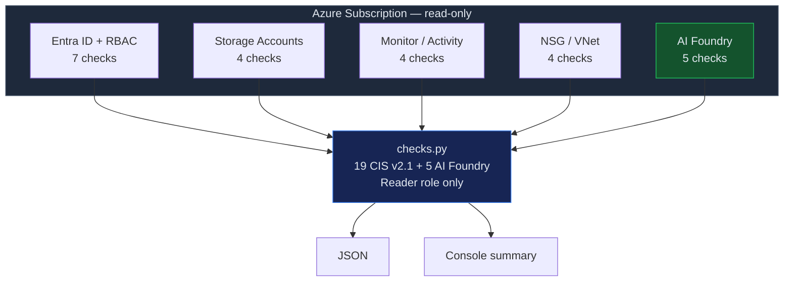

# CSPM — Azure CIS Foundations Benchmark v2.1

Automated assessment of Azure subscriptions against CIS Azure Foundations Benchmark
v2.1, plus Azure AI Foundry security controls. Each check mapped to NIST CSF 2.0.

## When to Use

- Azure subscription security posture assessment
- Pre-audit for SOC 2, ISO 27001, HIPAA
- Azure AI Foundry deployment review
- New subscription baseline validation
- Entra ID hygiene audit

## Architecture



## Security Guardrails

- **Read-only**: Requires `Reader` role only. Zero write permissions.
- **No credentials stored**: Azure credentials from `DefaultAzureCredential` (CLI, managed identity, env).
- **No data exfiltration**: Results stay local. No calls beyond Azure SDK.
- **AI Foundry safe**: Checks managed identity, private endpoints, CMK — does not access model endpoints or data.
- **Idempotent**: Run as often as needed with no side effects.

## Controls — CIS Azure Foundations v2.1 (key controls)

> The full CIS Azure Foundations Benchmark v2.1 has 90+ controls. This skill automates 19 high-impact checks plus 5 Azure AI Foundry security controls not covered by CIS.

### Section 1 — Identity & Access (7 checks)

| # | CIS Control | Severity | NIST CSF 2.0 |
|---|------------|----------|--------------|
| 1.1 | MFA for all users | CRITICAL | PR.AC-1 |
| 1.2 | Conditional Access policies enforced | HIGH | PR.AC-1 |
| 1.3 | No guest users with privileged roles | HIGH | PR.AC-4 |
| 1.4 | Custom subscription owner roles restricted | MEDIUM | PR.AC-4 |
| 1.5 | No legacy authentication protocols | HIGH | PR.AC-1 |
| 1.6 | Password expiration policy configured | MEDIUM | PR.AC-1 |
| 1.7 | PIM (Privileged Identity Management) enabled | HIGH | PR.AC-4 |

### Section 2 — Storage (4 checks)

| # | CIS Control | Severity | NIST CSF 2.0 |
|---|------------|----------|--------------|
| 2.1 | Storage account encryption (CMK where required) | HIGH | PR.DS-1 |
| 2.2 | Storage account HTTPS-only | HIGH | PR.DS-2 |
| 2.3 | No public blob access | CRITICAL | PR.AC-3 |
| 2.4 | Storage account network rules (deny by default) | HIGH | PR.AC-5 |

### Section 3 — Logging & Monitoring (4 checks)

| # | CIS Control | Severity | NIST CSF 2.0 |
|---|------------|----------|--------------|
| 3.1 | Activity log retention >= 365 days | MEDIUM | DE.AE-3 |
| 3.2 | Diagnostic settings for all subscriptions | HIGH | DE.AE-3 |
| 3.3 | Activity log alerts for policy/RBAC changes | MEDIUM | DE.CM-1 |
| 3.4 | Azure Monitor log profile covers all regions | MEDIUM | DE.CM-1 |

### Section 4 — Networking (4 checks)

| # | CIS Control | Severity | NIST CSF 2.0 |
|---|------------|----------|--------------|
| 4.1 | No unrestricted SSH (0.0.0.0/0:22) in NSGs | HIGH | PR.AC-5 |
| 4.2 | No unrestricted RDP (0.0.0.0/0:3389) in NSGs | HIGH | PR.AC-5 |
| 4.3 | NSG flow logs enabled | MEDIUM | DE.CM-1 |
| 4.4 | Network Watcher enabled in all regions | MEDIUM | DE.CM-1 |

### Azure AI Foundry Controls (Azure-Specific)

| # | Control | Severity | Rationale |
|---|---------|----------|-----------|
| A.1 | AI Foundry endpoints require managed identity auth | CRITICAL | Key-based auth = credential leak risk |
| A.2 | Private endpoints for AI services | HIGH | Public endpoints = attack surface |
| A.3 | CMK for AI model storage | MEDIUM | Protect training data + model weights |
| A.4 | Content Safety filters enabled | HIGH | Prevent harmful output in production |
| A.5 | Diagnostic logging on AI deployments | MEDIUM | Audit prompt/completion activity |

## Usage

```bash
# Run all checks
python src/checks.py --subscription-id SUB_ID

# Run specific section
python src/checks.py --subscription-id SUB_ID --section identity
python src/checks.py --subscription-id SUB_ID --section ai-foundry

# Output JSON
python src/checks.py --subscription-id SUB_ID --output json > cis-azure-results.json
```

## Remediation — Critical Findings

```
  FINDING: Public blob access enabled (2.3)
  ──────────────────────────────────────────
  FIX:     az storage account update --name ACCOUNT --resource-group RG \
             --allow-blob-public-access false
  VERIFY:  az storage account show --name ACCOUNT --query allowBlobPublicAccess
```

```
  FINDING: AI Foundry endpoint using key auth (A.1)
  ──────────────────────────────────────────────────
  FIX:     az cognitiveservices account update --name ACCOUNT --resource-group RG \
             --disable-local-auth true
  VERIFY:  az cognitiveservices account show --name ACCOUNT --query disableLocalAuth
```

## Posture Metrics

| Metric | Target |
|--------|--------|
| CIS Pass Rate | > 90% |
| MFA Coverage | 100% |
| Public Storage Accounts | 0 |
| NSGs without Flow Logs | 0 |
| AI Endpoints without Private Link | 0 |
| Activity Log Retention | >= 365 days |
