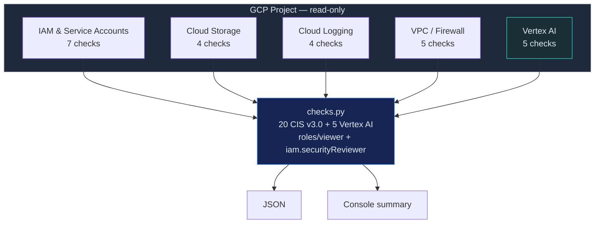

# CSPM — GCP CIS Foundations Benchmark v3.0

Automated assessment of GCP projects against CIS GCP Foundations Benchmark v3.0,
plus Vertex AI security controls. Each check mapped to NIST CSF 2.0.

## When to Use

- GCP project security posture assessment
- Pre-audit for SOC 2, ISO 27001, FedRAMP
- Vertex AI deployment security review
- New project baseline validation
- Service account key hygiene audit

## Architecture



## Security Guardrails

- **Read-only**: Requires `roles/viewer` + `roles/iam.securityReviewer`. Zero write permissions.
- **No credentials stored**: GCP credentials from ADC (Application Default Credentials) only.
- **No data exfiltration**: Results stay local. No calls beyond GCP SDK.
- **Vertex AI safe**: Checks endpoint auth, VPC-SC, CMEK — does not access model data or training data.
- **Idempotent**: Run as often as needed with no side effects.

## Controls — CIS GCP Foundations v3.0 (key controls)

> The full CIS GCP Foundations Benchmark v3.0 has 80+ controls. This skill automates 20 high-impact checks plus 5 Vertex AI security controls not covered by CIS.

### Section 1 — IAM (7 checks)

| # | CIS Control | Severity | NIST CSF 2.0 |
|---|------------|----------|--------------|
| 1.1 | Corporate credentials only (no personal Gmail) | HIGH | PR.AC-1 |
| 1.2 | MFA enforced org-wide | CRITICAL | PR.AC-1 |
| 1.3 | No user-managed service account keys | HIGH | PR.AC-1 |
| 1.4 | Service account key rotation (90 days) | MEDIUM | PR.AC-1 |
| 1.5 | No keys for default compute/App Engine SAs | HIGH | PR.AC-4 |
| 1.6 | No project-wide SSH keys | MEDIUM | PR.AC-5 |
| 1.7 | SA impersonation scoped (serviceAccountTokenCreator) | HIGH | PR.AC-4 |

### Section 2 — Cloud Storage (4 checks)

| # | CIS Control | Severity | NIST CSF 2.0 |
|---|------------|----------|--------------|
| 2.1 | Uniform bucket-level access (no legacy ACL) | HIGH | PR.AC-3 |
| 2.2 | Bucket retention policy on compliance buckets | MEDIUM | PR.DS-1 |
| 2.3 | No public buckets (allUsers/allAuthenticatedUsers) | CRITICAL | PR.AC-3 |
| 2.4 | CMEK encryption on sensitive data | MEDIUM | PR.DS-1 |

### Section 3 — Logging (4 checks)

| # | CIS Control | Severity | NIST CSF 2.0 |
|---|------------|----------|--------------|
| 3.1 | Data Access audit logs for all services | CRITICAL | DE.AE-3 |
| 3.2 | Org-level log sink configured | HIGH | DE.AE-3 |
| 3.3 | Log bucket retention >= 365 days | MEDIUM | DE.AE-5 |
| 3.4 | Alert policies for IAM/firewall/route changes | MEDIUM | DE.CM-1 |

### Section 4 — Networking (5 checks)

| # | CIS Control | Severity | NIST CSF 2.0 |
|---|------------|----------|--------------|
| 4.1 | Default VPC deleted | MEDIUM | PR.AC-5 |
| 4.2 | No unrestricted SSH/RDP (0.0.0.0/0 on 22/3389) | HIGH | PR.AC-5 |
| 4.3 | VPC flow logs on all subnets | MEDIUM | DE.CM-1 |
| 4.4 | Private Google Access enabled | MEDIUM | PR.AC-5 |
| 4.5 | SSL policies enforce TLS 1.2+ | HIGH | PR.DS-2 |

### Vertex AI Controls (GCP-Specific)

| # | Control | Severity | Rationale |
|---|---------|----------|-----------|
| V.1 | Model endpoints require IAM auth | CRITICAL | Unauthenticated endpoints = prompt injection surface |
| V.2 | Vertex AI inside VPC Service Controls | HIGH | Prevent data exfiltration via API calls |
| V.3 | CMEK for training data | MEDIUM | Protect model training datasets |
| V.4 | Model registry audit (version lineage) | MEDIUM | Detect model tampering |
| V.5 | No public Vertex AI endpoints | CRITICAL | Public endpoints = attack surface |

## Usage

```bash
# Run all checks
python src/checks.py --project my-project-id

# Run specific section
python src/checks.py --project my-project-id --section iam
python src/checks.py --project my-project-id --section vertex-ai

# Output JSON
python src/checks.py --project my-project-id --output json > cis-gcp-results.json
```

## Remediation — Critical Findings

```
  FINDING: Public Cloud Storage bucket (2.3)
  ───────────────────────────────────────────
  FIX:     gsutil iam ch -d allUsers gs://BUCKET
           gsutil iam ch -d allAuthenticatedUsers gs://BUCKET
  VERIFY:  gsutil iam get gs://BUCKET | grep -c "allUsers"  # should be 0
```

```
  FINDING: Vertex AI endpoint publicly accessible (V.5)
  ─────────────────────────────────────────────────────
  FIX:     gcloud ai endpoints update ENDPOINT_ID --region=REGION --clear-traffic-split
           # Then configure VPC-SC perimeter for Vertex AI
  VERIFY:  gcloud ai endpoints describe ENDPOINT_ID --format=json | jq '.network'
```

## Posture Metrics

| Metric | Target |
|--------|--------|
| CIS Pass Rate | > 90% |
| Service Accounts with User Keys | 0 |
| Public Buckets | 0 |
| Subnets without Flow Logs | 0 |
| Vertex AI Endpoints without VPC-SC | 0 |
| Audit Logging Coverage | 100% of services |
