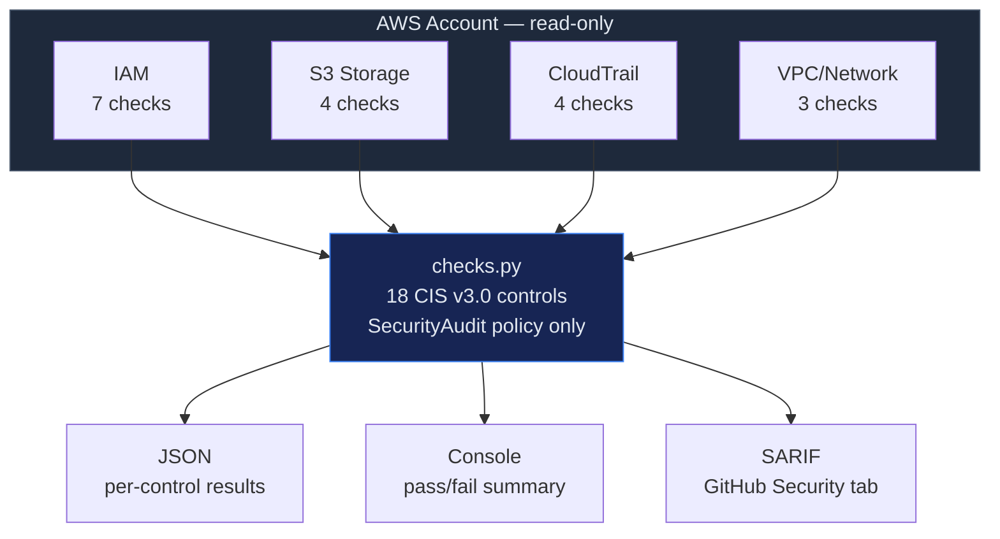

# CSPM — AWS CIS Foundations Benchmark v3.0

Automated assessment of AWS accounts against the CIS AWS Foundations Benchmark v3.0.
18 checks across 4 domains, each mapped to NIST CSF 2.0, ISO 27001:2022, and SOC 2.

## When to Use

- Periodic cloud security posture assessment (monthly/quarterly)
- Pre-audit preparation for SOC 2, ISO 27001, or PCI DSS
- Post-incident validation that security controls are intact
- New account baseline — verify guardrails before workloads deploy
- Compliance evidence generation for auditors

## Architecture



## Security Guardrails

- **Read-only**: Requires only `SecurityAudit` managed policy. Zero write permissions.
- **No credentials stored**: AWS credentials come from environment/instance profile only.
- **No data exfiltration**: Check results stay local. No external API calls beyond AWS SDK.
- **Safe to run in production**: Cannot modify any AWS resources.
- **Idempotent**: Run as often as needed with no side effects.

## Controls — CIS AWS Foundations v3.0 (key controls)

> The full CIS AWS Foundations Benchmark v3.0 has 60+ controls. This skill automates the 18 most impactful checks — the ones most frequently flagged in audits and with the highest blast radius if misconfigured.

### Section 1 — IAM (7 checks)

| # | CIS Control | Severity | NIST CSF 2.0 | ISO 27001 |
|---|------------|----------|--------------|-----------|
| 1.1 | MFA on root account | CRITICAL | PR.AC-1 | A.8.5 |
| 1.2 | MFA for console users | HIGH | PR.AC-1 | A.8.5 |
| 1.3 | Credentials unused 45+ days | MEDIUM | PR.AC-1 | A.5.18 |
| 1.4 | Access keys rotated 90 days | MEDIUM | PR.AC-1 | A.5.17 |
| 1.5 | Password policy strength | MEDIUM | PR.AC-1 | A.5.17 |
| 1.6 | No root access keys | CRITICAL | PR.AC-4 | A.8.2 |
| 1.7 | No inline IAM policies | LOW | PR.AC-4 | A.5.15 |

### Section 2 — Storage (4 checks)

| # | CIS Control | Severity | NIST CSF 2.0 | ISO 27001 |
|---|------------|----------|--------------|-----------|
| 2.1 | S3 default encryption | HIGH | PR.DS-1 | A.8.24 |
| 2.2 | S3 server access logging | MEDIUM | DE.AE-3 | A.8.15 |
| 2.3 | S3 public access blocked | CRITICAL | PR.AC-3 | A.8.3 |
| 2.4 | S3 versioning enabled | MEDIUM | PR.DS-1 | A.8.13 |

### Section 3 — Logging (4 checks)

| # | CIS Control | Severity | NIST CSF 2.0 | ISO 27001 |
|---|------------|----------|--------------|-----------|
| 3.1 | CloudTrail multi-region | CRITICAL | DE.AE-3 | A.8.15 |
| 3.2 | CloudTrail log validation | HIGH | PR.DS-6 | A.8.15 |
| 3.3 | CloudTrail S3 not public | CRITICAL | PR.AC-3 | A.8.3 |
| 3.4 | CloudWatch alarms configured | MEDIUM | DE.CM-1 | A.8.16 |

### Section 4 — Networking (3 checks)

| # | CIS Control | Severity | NIST CSF 2.0 | ISO 27001 |
|---|------------|----------|--------------|-----------|
| 4.1 | No unrestricted SSH (0.0.0.0/0:22) | HIGH | PR.AC-5 | A.8.20 |
| 4.2 | No unrestricted RDP (0.0.0.0/0:3389) | HIGH | PR.AC-5 | A.8.20 |
| 4.3 | VPC flow logs enabled | MEDIUM | DE.CM-1 | A.8.16 |

## Usage

```bash
# Run all checks
python src/checks.py

# Run specific section
python src/checks.py --section iam
python src/checks.py --section storage
python src/checks.py --section logging
python src/checks.py --section networking

# Output JSON for SIEM/warehouse ingestion
python src/checks.py --output json > cis-aws-results.json

# Specific region
python src/checks.py --region us-east-1
```

## Remediation — Critical Findings

```
  FINDING: Root account has access keys (1.6)
  ────────────────────────────────────────────
  WHY:     Root keys = unlimited blast radius. Compromised root = full account takeover.
  FIX:     aws iam delete-access-key --user-name root --access-key-id AKIA...
  VERIFY:  python src/checks.py --section iam | grep "1.6"
```

```
  FINDING: S3 bucket publicly accessible (2.3)
  ─────────────────────────────────────────────
  WHY:     Public S3 = data exfiltration. #1 source of cloud data breaches.
  FIX:     aws s3api put-public-access-block --bucket BUCKET \
             --public-access-block-configuration \
             BlockPublicAcls=true,IgnorePublicAcls=true,BlockPublicPolicy=true,RestrictPublicBuckets=true
  VERIFY:  python src/checks.py --section storage | grep "2.3"
```

## Validate with agent-bom

```bash
# agent-bom has built-in CIS AWS checks — use for continuous monitoring
agent-bom scan --aws --aws-region us-east-1 --aws-cis-benchmark

# Via MCP tool
cis_benchmark(provider="aws", region="us-east-1")
```

## Posture Metrics

| Metric | Target |
|--------|--------|
| CIS Pass Rate | > 90% |
| Critical Findings | 0 |
| IAM MFA Coverage | 100% |
| Stale Access Keys | 0 |
| Public S3 Buckets | 0 |
| CloudTrail Coverage | 100% of regions |
