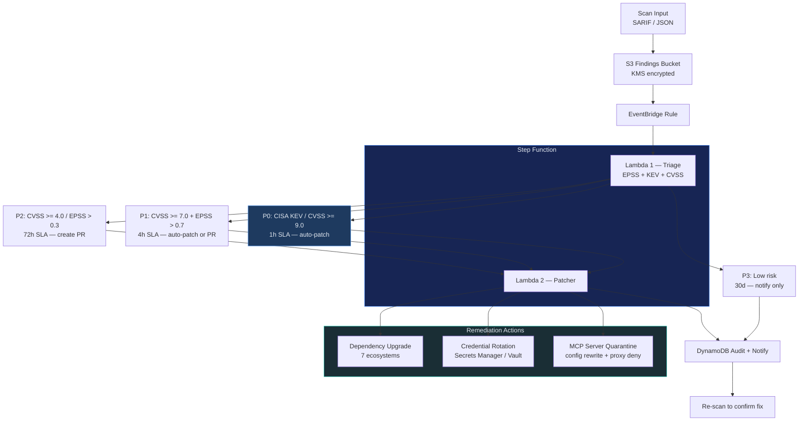

# Vulnerability Remediation Pipeline

Automated remediation for AI supply chain vulnerabilities — from scan findings to
patched dependencies, rotated credentials, and quarantined servers.

Read [reference.md](reference.md) for detailed architecture, framework mappings,
and security model. Read [examples.md](examples.md) for deployment walkthroughs.

## When to Use

- agent-bom scan finds critical/high vulnerabilities in MCP server dependencies
- CISA KEV alert on a package used by production agents
- Credential exposure detected in MCP server configs
- Stale or unpatched AI agent dependencies need bulk upgrade
- Compliance requires automated patching within SLA (SOC 2 CC7.1, CIS 7.3)
- OWASP MCP-04 (Tool Poisoning) or LLM-05 (Supply Chain) findings

## Pipeline Overview



## Security Guardrails

- **PR-first**: P1/P2 fixes go through code review. Only P0 (KEV/CVSS 9.0+) auto-applies to main.
- **Rollback window**: Rotated credentials are deactivated (not deleted) for 24h rollback.
- **Protected packages**: Allowlist prevents breaking pinned dependencies.
- **VEX support**: Accept VEX justifications to suppress false positives.
- **MCP quarantine is reversible**: Auto-unquarantines when fix becomes available.
- **Skip conditions**: Already patched, no fix available, suppressed by VEX, in grace period — all handled.
- **Audit trail**: Every action logged to DynamoDB + S3.
```

## Triage Logic

The triage Lambda classifies each finding into an action tier:

| Tier | Criteria | SLA | Action |
|------|----------|-----|--------|
| P0 — Immediate | CISA KEV or CVSS ≥ 9.0 | 1h | Auto-patch + quarantine if needed |
| P1 — Urgent | CVSS ≥ 7.0 AND EPSS > 0.7 | 4h | Auto-patch, PR if risky |
| P2 — Standard | CVSS ≥ 4.0 OR EPSS > 0.3 | 72h | Create PR for review |
| P3 — Backlog | CVSS < 4.0 AND EPSS < 0.3 | 30d | Notify, add to backlog |

### Skip Conditions

1. **Already patched** → finding exists in remediation log, skip
2. **No fix available** → log as "awaiting upstream", notify
3. **Suppressed by VEX** → VEX justification accepted, skip
4. **Protected package** → on allowlist (pinned for compatibility), notify only
5. **In grace period** → recently deployed, wait for stability window

## Remediation Actions

### 1. Dependency Upgrade (7 ecosystems)

| Ecosystem | Method | File Modified |
|-----------|--------|---------------|
| npm | `npm install pkg@fixed` | package.json, package-lock.json |
| pip | `pip install pkg==fixed` | requirements.txt, pyproject.toml |
| cargo | `cargo update -p pkg` | Cargo.toml, Cargo.lock |
| go | `go get pkg@fixed` | go.mod, go.sum |
| maven | Update version in pom | pom.xml |
| nuget | `dotnet add package pkg --version fixed` | *.csproj |
| rubygems | `bundle update pkg` | Gemfile, Gemfile.lock |

**PR mode** (default for P1/P2): Creates a branch, applies fix, runs tests, opens PR.
**Direct mode** (P0 only): Applies fix to main, tags with `security-patch`.

### 2. Credential Rotation

When agent-bom detects exposed credentials in MCP server configs:

| Credential Type | Rotation Method |
|----------------|-----------------|
| AWS Access Key | IAM CreateAccessKey → update config → DeleteOldKey |
| GitHub PAT | gh auth token refresh → update config |
| Database password | Secrets Manager RotateSecret → update config |
| API key (generic) | Vault rotate → update config |
| MCP server token | Generate new → update all referencing clients |

**Safety**: Old credential is deactivated (not deleted) for 24h rollback window.

### 3. MCP Server Quarantine

When a server has a critical vulnerability with no available fix:

1. **Tag** server config with `quarantined: true, reason: CVE-XXXX-YYYY`
2. **Restrict** — update MCP client configs to add `--read-only` flag
3. **Alert** — notify server owner via configured channel
4. **Block** — if policy enforcement enabled, add to proxy deny list
5. **Log** — DynamoDB audit record with quarantine timestamp

Quarantine is **reversible**: when fix becomes available, pipeline auto-unquarantines.

## AWS IAM Roles Required

| Component | Role | Key Permissions |
|-----------|------|-----------------|
| Lambda 1 (Triage) | `vuln-remediation-triage-role` | `s3:GetObject`, `dynamodb:Query` |
| Lambda 2 (Patcher) | `vuln-remediation-patcher-role` | `s3:GetObject`, `secretsmanager:RotateSecret`, `iam:CreateAccessKey` |
| Step Function | `vuln-remediation-sfn-role` | `lambda:InvokeFunction` on both Lambdas |
| EventBridge | `vuln-remediation-events-role` | `states:StartExecution` |
| GitHub Actions | OIDC federation | `sts:AssumeRoleWithWebIdentity` for PR creation |

## Integration with agent-bom

```bash
# Scan and export findings for the pipeline
agent-bom scan -f sarif -o findings.sarif --enrich --fail-on-kev

# Upload to S3 trigger bucket
aws s3 cp findings.sarif s3://vuln-remediation-findings/incoming/

# Or use MCP tool directly
remediate(config_path="~/.config", auto_apply=false, pr_mode=true)
```

The pipeline also accepts findings from:
- **CSPM skills** (CIS benchmark failures → infrastructure remediation)
- **agent-bom fleet_scan** (bulk registry lookups → batch patching)
- **Third-party scanners** (any SARIF-compatible output)

## Security Principles

- **Least privilege**: Patcher role scoped to specific repos/secrets
- **Rollback window**: Credentials deactivated (not deleted) for 24h
- **PR-first**: P1/P2 fixes go through review, only P0 auto-applies
- **Audit trail**: Every action logged to DynamoDB + S3
- **VEX support**: Accept VEX justifications to suppress false positives
- **Protected packages**: Allowlist prevents breaking pinned dependencies

## Project Structure

```
skills/vuln-remediation-pipeline/
├── SKILL.md                    # This file
├── reference.md                # Architecture + framework mappings
├── examples.md                 # Deployment walkthroughs
├── src/
│   ├── orchestrator/
│   │   ├── ingest.py           # SARIF/JSON parser + S3 upload
│   │   ├── triage.py           # EPSS/KEV/CVSS tier classification
│   │   └── dedup.py            # Remediation log dedup
│   ├── lambda_triage/
│   │   └── handler.py          # Lambda 1: classify + filter
│   └── lambda_patcher/
│       ├── handler.py          # Lambda 2: apply fixes
│       ├── ecosystems/         # Per-ecosystem upgrade logic
│       │   ├── npm.py
│       │   ├── pip_pkg.py
│       │   ├── cargo.py
│       │   ├── golang.py
│       │   ├── maven.py
│       │   ├── nuget.py
│       │   └── rubygems.py
│       ├── credentials.py      # Credential rotation handlers
│       └── quarantine.py       # MCP server quarantine logic
├── infra/
│   ├── cloudformation.yaml     # Full stack
│   ├── terraform/
│   │   └── main.tf             # Terraform equivalent
│   └── step_function.asl.json  # ASL definition
└── tests/
```

## MITRE ATT&CK Coverage

| Technique | ID | How This Skill Addresses It |
|-----------|-----|---------------------------|
| Supply Chain Compromise | T1195.002 | Auto-patch vulnerable dependencies |
| Valid Accounts: Cloud | T1078.004 | Credential rotation on exposure |
| Exploitation of Remote Services | T1210 | Quarantine vulnerable MCP servers |
| Unsecured Credentials | T1552 | Rotate + restrict exposed secrets |
| Software Discovery | T1518 | SARIF ingest tracks all packages |

## CIS Benchmark Cross-Reference

| CIS Control | Benchmark | What This Skill Remediates |
|------------|-----------|---------------------------|
| 7.1 — Establish vulnerability management | CIS Controls v8 | Automated triage + SLA enforcement |
| 7.2 — Establish remediation process | CIS Controls v8 | PR-based patching pipeline |
| 7.3 — Perform automated remediation | CIS Controls v8 | P0 auto-apply, P1/P2 PR creation |
| 7.4 — Perform automated patch management | CIS Controls v8 | 7-ecosystem upgrade automation |
| 16.1 — Establish secure app development | CIS Controls v8 | Supply chain fix verification |

## OWASP Coverage

| Risk | ID | How This Skill Addresses It |
|------|-----|---------------------------|
| Supply Chain Vulnerabilities | LLM-05 | Auto-patch AI framework dependencies |
| Tool Poisoning | MCP-04 | Quarantine compromised MCP servers |
| Excessive Agency | LLM-08 | Restrict quarantined server capabilities |
| Insecure Plugin Design | LLM-07 | Credential rotation removes hardcoded secrets |

> **Workflow**: Run `agent-bom scan --enrich` to identify vulnerabilities → this skill
> automatically remediates them. Detection (agent-bom) + Response (this pipeline).
